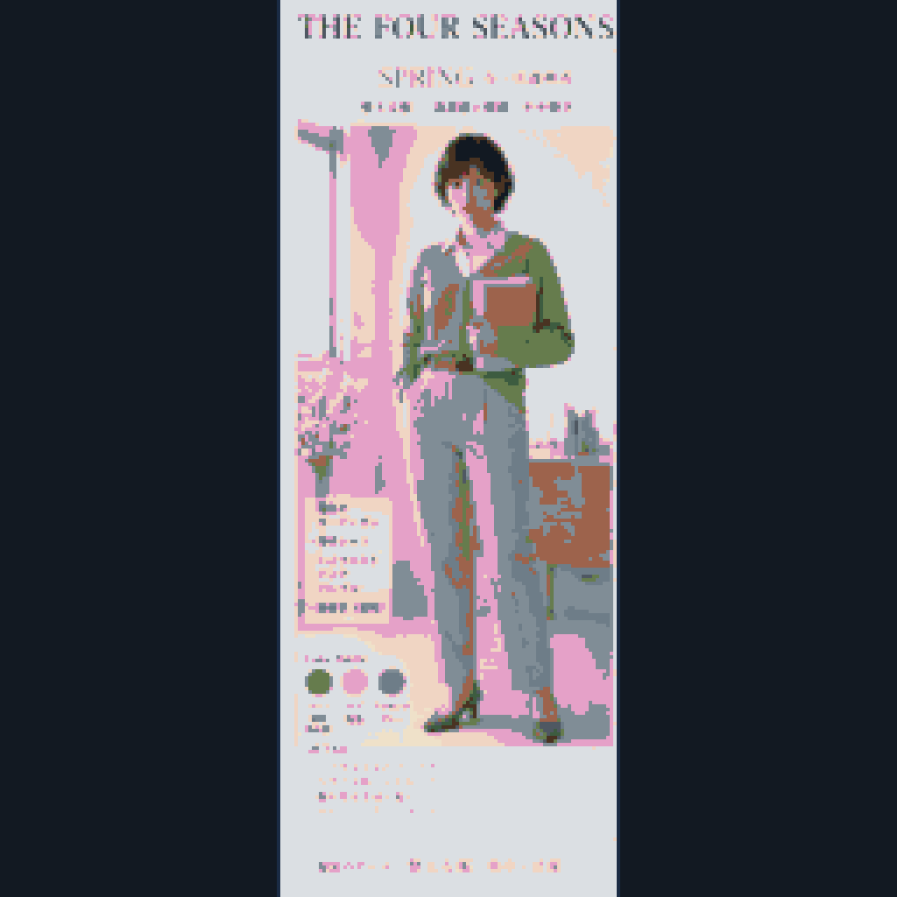
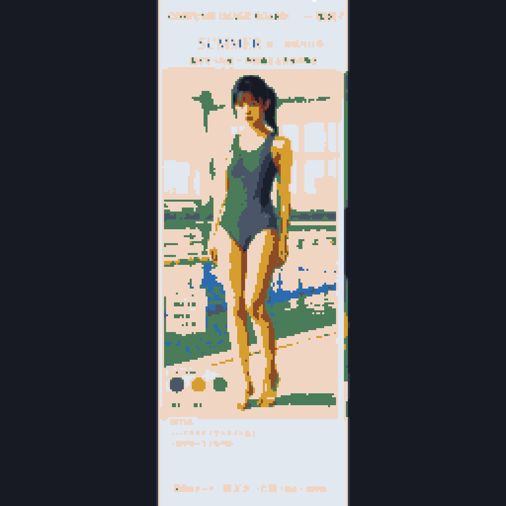
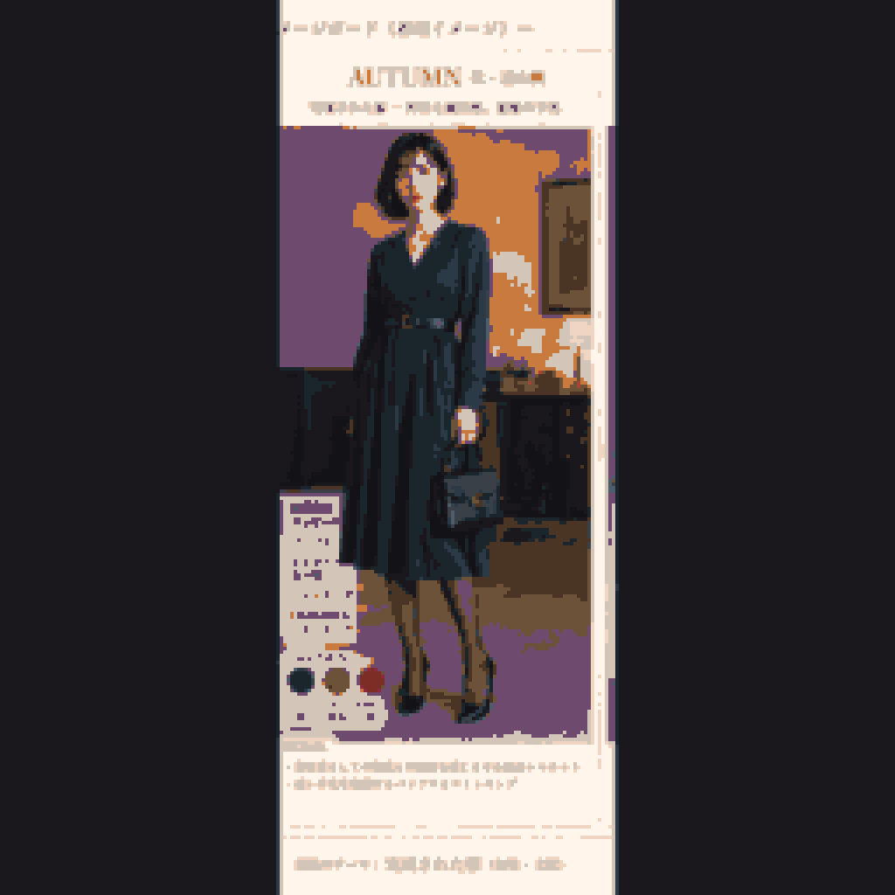
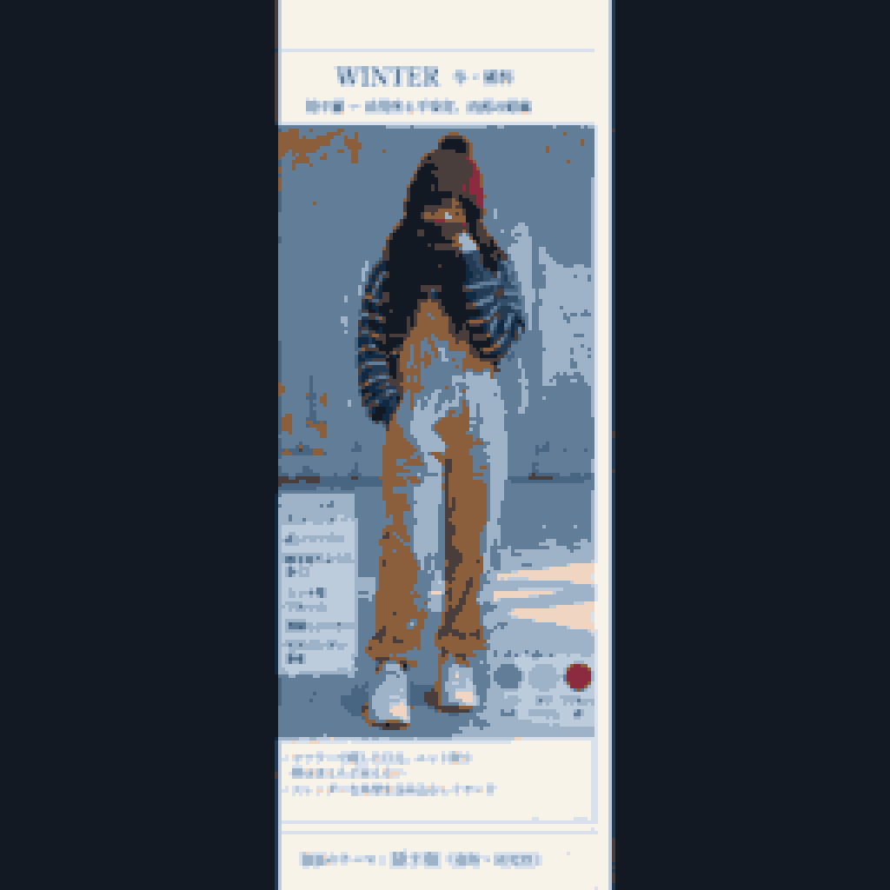

# 👤 登場人物・キャラクター一覧

『THE FOUR SEASONS』の主要キャラクター4名。**各人物の設定はそれぞれのノートが唯一の正**であり、このページは共通ルールと入口だけを持つ。

| | 🌸 春 | 🌻 夏 | 🍁 秋 | ❄️ 冬 |
| :---: | :---: | :---: | :---: | :---: |
| |  |  |  |  |
| | **[[characters/tanabe-momoka\|田邊 桃香]]** | **[[characters/kaneshiro-himawari\|金城 向日葵]]** | **[[characters/toyama-kaede\|遠山 楓]]** | **[[characters/tachibana-hiiragi\|橘 柊]]** |
| | 23歳・新任教師（英語科） | 18歳・高校生 | 26歳・会社員 | 19歳・大学生 |
| | 潔癖の陥落 | 放逸と無惨 | 美貌と権威の失墜 | 退行と擬態 |

---

## 📊 横断比較（Bases）

数値・属性の横断比較は **[[characters.base|characters.base]]** が frontmatter から自動生成する。手書きの比較表は持たない。

```base
views:
  - type: table
    name: プロフィール
    order:
      - name_ja
      - season
      - age
      - height_cm
      - head_ratio
      - occupation
```

---

## 🎮 表情グラフィック：全キャラ共通の6パターン定義

本作を90年代レトロノベルゲーム（PC-98やSFC風サウンドノベル）として構築する際、テキストウィンドウ横に表示される**全キャラクター共通の表情アイコン**の定義。物語が誇りから破綻、そして倒錯的な適応へと向かうプロセスを、会話アイコンの表情変化として視覚的に表現する。

**各キャラクターごとの描き分けは、それぞれのノートの「表情パターン」節に記載。**

| パターン名 | 感情・状態の定義 | 画面上の描写特徴 | 劇中での発生タイミング |
| :--- | :--- | :--- | :--- |
| **1. 通常 (Neutral)** | ペルソナを維持した日常の顔 | 涼しげな目元、引き締まった口元。背景は通常トーン | 章の序盤・日常会話・社会的対応 |
| **2. 笑顔・安堵 (Smile)** | 魅せる笑顔、または一過性の安堵 | 柔らかい目元、微かな口元の微笑み | 良好な他者対応・危機を脱した錯覚 |
| **3. 警戒・違和感 (Suspicion)** | 異変や周囲の視線を察知 | わずかに狭まる瞳、硬く引かれた口元、視線が揺れる | 密室の罠・逃げ場の喪失の予感 |
| **4. 抑圧・冷や汗 (Anxiety)** | 生理的緊張・破綻の隠蔽 | 眉が寄り、**額に冷や汗の粒**。必死に噛み締める唇 | 会議室・西日の教室での耐える瞬間 |
| **5. 狼狽・大赤面 (Panic)** | 破綻の瞬間・激しい羞恥 | **耳たぶ〜首筋にかけての大赤面**、涙目の瞳、開いた口 | 露出・失禁の直前〜直後 |
| **6. 虚脱・完全適応 (Acceptance)** | 尊厳の死滅と被支配への安堵 | **瞳から光が消える**、虚ろな眼差し、微かな諦念の笑み | 屈服・完全適応の結末 |

---

## 🧭 4人を分ける軸

差別化が偶然にならないよう、以下の軸で意図的に配置されている。

| 軸 | 桃香 | 向日葵 | 楓 | 柊 |
| :--- | :--- | :--- | :--- | :--- |
| **破綻の主体** | 強制（仕組まれる） | 偶然（事故） | 強制（弱みを握られる） | **自発（自ら降りる）** |
| **等身** | 7.5 | 7.0 | **8.0** | 6.5 |
| **下着の性格** | 魅せるレース | 機能一辺倒 | 完璧な上下セット | **ブラを着けない** |
| **靴** | パンプス（規律） | 紐スニーカー（自分で走る） | パンプス（教養と資力） | マジックテープ（結ぶのを放棄） |

> [!note] 靴と下着に置かれた対比
> **紐を自分で結ぶか、結ばなくていいか。** 向日葵は履き込んだ紐スニーカー、柊はマジックテープの子供靴。柊の自己決定の拒絶が足元から始まっていることを示す。
> 下着も同様に、4人中3人が「着ているもの」で語られるのに対し、柊だけが「着ていないもの」で語られる。

> [!important] おむつは桃香の専売
> 桃香＝*他者に強制された罰*としてのおむつ。柊＝*自分で選んだ擬態*としての子供用パンツ。同じ幼児化に見えて、主体と動機が正反対に置かれている。

---

### 🔗 関連ノート
* [[キャラクター設定画・分離生成ガイダンス]] — 顔・肉体・服装の分離管理の考え方
* [[rules/comfyui-mcp-workflows|ComfyUI MCP用 ワークフロー規定]] — 素材生成の手順
* [[rules/color-palettes|季節別16色パレット規定]]
