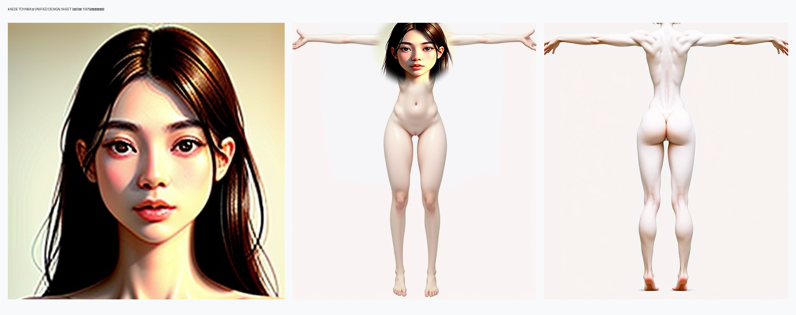
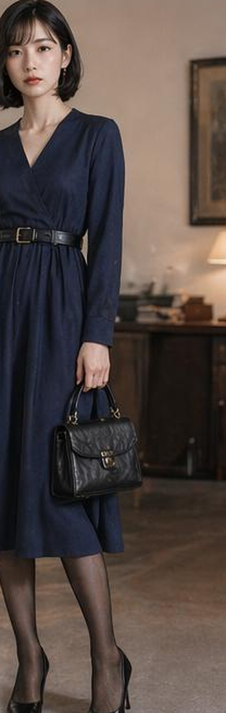
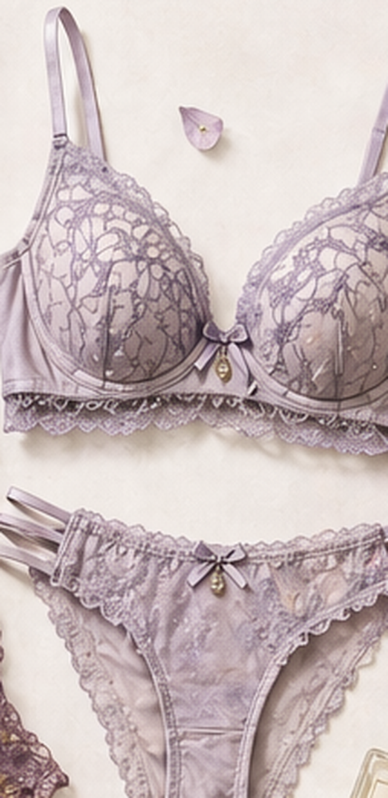

# 🍁 遠山 楓 — 外貌設定シート

> [!abstract] コンセプト概要
> 第3章「秋」の主人公。**「侵しがたい女神」を成立させるための、隙のない外貌**を定義する。
> 顔は和風の知性美（柔らかさ＋神経質さ）、肉体は8頭身の健康的スレンダー、服装は紺碧のワンピースで統一された「完成された服」。
> 下着に至るまでラベンダーで揃っているのは、**誰にも見せない場所まで完璧である**という自負の表現であり、第3章の失墜で最も強く裏返る部分でもある。
>
> 本シートは [[キャラクター設定画・分離生成ガイダンス]] に従い、**顔 / 肉体 / 服装を独立管理**する。物語・心理設定は [[characters/toyama-kaede|遠山 楓（本編設定）]] を参照。

---

## 📇 基本プロフィール（設定シート確定値）

| 項目 | 値 |  | 項目 | 値 |
| :--- | :--- | :-- | :--- | :--- |
| **年齢** | 26歳 | | **身長** | **165cm** |
| **職業** | 会社員（大手企業 総合職） | | **血液型** | AB型 |
| **誕生日** | 10月10日 | | **性格** | プライドが高い |
| **好きなもの** | 紅茶、読書、クラシック音楽 | | **苦手なもの** | 騒がしい場所、時間に追われること |
| **特技・趣味** | フランス語、ピアノ、ワインを嗜むこと | | **その他** | **ストッキングは常に予備を携帯** |

> [!quote] 「予備を携帯している」ことの意味
> 破れることを想定して備えているのに、それでも第3章では**替える猶予すら与えられずに泥の中で膝を折る**。用意周到さが無意味になる瞬間こそが、この人物の失墜の核心にある。

出典：`content/assets/references/0 ４人の設定画アニメ調.png`（四人の主人公 設定シート）

---

## 🗺️ 3要素の分離マップ

```
┌─────────────┐   ┌─────────────┐   ┌─────────────┐
│  ① 顔       │   │  ② 肉体     │   │  ③ 服装     │
│  FACE       │ × │  BODY       │ × │  OUTFIT     │
├─────────────┤   ├─────────────┤   ├─────────────┤
│ 黒髪ロング  │   │ 8頭身       │   │ 紺ワンピース│
│ 垂れ眉      │   │ 健康的      │   │ 黒ベルト    │
│ 子鹿の瞳    │   │ スレンダー  │   │ パンスト    │
│ 和風知性美  │   │ 色白        │   │ 黒パンプス  │
├─────────────┤   ├─────────────┤   ├─────────────┤
│ 確定 ✅     │   │ 確定 ✅     │   │ 確定 ✅     │
└─────────────┘   └─────────────┘   └─────────────┘
      ↓                 ↓                 ↓
   IP-Adapter      ControlNet /       IP-Adapter
   （同一性）      素体参照            （衣装参照）
```

---

# ① 顔（FACE）

## 🎭 確定仕様

| 項目 | 設定 |
| :--- | :--- |
| **輪郭** | 卵型〜やや面長。細い顎、シャープすぎない柔らかい線 |
| **髪色・質感** | 濡れたような艶のある黒髪（オータムライトで濃いブラウンに転ぶ） |
| **髪型（素）** | ロングストレート。centre-partに近い自然な分け目、鎖骨より下まで |
| **髪型（勤務時）** | **低い位置でまとめた夜会巻き／低めのシニヨン**。後れ毛を許さない端正さ |
| **眉** | オータムカラーの濃いめブラウン、**垂れ眉**。柔和さの源 |
| **目** | **子鹿風の澄んだ瞳**。明るめブラウン、やや大きめの二重。睫毛は長く自然 |
| **鼻** | 通った細い鼻筋、小さめの鼻先 |
| **口** | 薄めの上唇＋ふっくらした下唇。コーラルレッドのリップ |
| **肌** | 色白、きめ細かくマット。ファンデーションの均一感 |
| **雰囲気** | 小西真奈美的な柔らかさと、高学歴先輩の**神経質さが同居** |

> [!warning] 髪型の正
> 着用イメージボード `kaede_fullbody_base.jpg` は**ボブ**で描かれているが、これは誤り。
> **正は「ロングストレート、勤務中はまとめ髪」**。顔の確定素材15枚がすべてロングであるため、ボードの方を後日差し替える。

> [!example]- 顔 生成プロンプト（Face Reference）
> **状態**: クローズアップ / ニュートラル表情 / 正面
> ```text
> photorealistic, semi-realistic 3d character render, extreme close-up portrait of a japanese woman, Kaede Toyama, long straight glossy black hair, centre parted, soft drooping eyebrows in dark autumn brown, clear deer-like light brown eyes, double eyelids, long natural lashes, slender straight nose, thin upper lip and full lower lip, coral red lipstick, fair matte porcelain skin, refined intellectual and slightly nervous expression, neutral expression, plain white background, soft even studio lighting, high detail
> ```
> **Negative**: `anime, cel shading, cartoon, big anime eyes, short hair, bob cut, brown hair, blonde, heavy makeup, smiling, freckles, blemishes, text, watermark`

## 🖼️ 顔・確定素材

| 決定版 正面顔 | 統合デザインシート（3-in-1） |
| :---: | :---: |
|  |  |
| `kaede_face_front_base.jpg` | `kaede_unified_design_sheet.jpg` |

**検討バリエーション（アーカイブ）**：`kaede_face_cropped_base.jpg` / `kaede_face_autumn_b・c` / `kaede_face_c1〜c3` / `kaede_face_konishi_a〜c` / `kaede_face_var_a〜c`

---

# ② 肉体（BODY）

## 🦴 確定仕様

| 項目 | 設定 |
| :--- | :--- |
| **身長・等身** | **165cm**（設定シート確定値）。**8頭身**のスレンダープロポーション |
| **体型** | 健康的スレンダー。脂肪も筋肉も少なく、**線の細さが威圧感に転じる**タイプ |
| **バスト** | 小さめ〜控えめ。素体画準拠で、豊満さではなく薄さで構成 |
| **ウエスト** | 明確なくびれ。肋骨の下から腰骨までが長い |
| **ヒップ** | 細身ながら丸みのある形状（背面素体で確定） |
| **四肢** | 長い手足、細い手首・足首。指も長くしなやか |
| **肌** | 陶器のような白さ、マットな質感。日焼けの痕跡なし |
| **背面特徴** | **肩甲骨と背骨のラインがくっきり出る**。うなじが美しく、まとめ髪と対になる |
| **足** | 甲の薄い細身の足。ハイヒールが映える形状 |

> [!example]- 肉体 生成プロンプト（Body / Anatomy Reference）
> **状態**: 全裸（素体）/ Aポーズ・Tポーズ / 全身
> ```text
> photorealistic, semi-realistic 3d character render, soft matte skin, full body shot of an unclothed slender japanese woman, T-pose, standing straight, anatomically accurate proportions, 8 heads tall, tall and slim, small bust, defined waist, long limbs, thin wrists and ankles, fair porcelain skin, visible shoulder blades and spine line, no tan lines, plain white background, flat even studio lighting, anatomy reference sheet
> ```
> **Negative**: `clothes, underwear, large breasts, muscular, overweight, anime, cel shading, cartoon, dramatic lighting, shadows, text, watermark`

## 🖼️ 肉体・確定素材

| Tポーズ 正面 | Tポーズ 背面 |
| :---: | :---: |
|  |  |
| `kaede_body_tpose_base.jpg` | `kaede_body_tpose_back_base.jpg` |

**その他**：`kaede_fullbody_nude_perfect.jpg`（全身素体・決定版） / `kaede_fullbody_nude_base.jpg` / `kaede_fullbody_nude_comfyui.png`

> [!bug] リンク切れ
> [[characters/kaede-nude-design-sheets|素体設定画ガイド]] が参照している `kaede_fullbody_nude_var1.jpg` / `var2.jpg` / `var3.jpg` は**実体が存在しない**。生成し直すか、当該ページの記述を削除する必要がある。

---

# ③ 服装（OUTFIT）

## 👗 通常時（完成された服 — 知性・支配）

### 表着

| 部位 | 設定 |
| :--- | :--- |
| **ワンピース** | 紺碧（ディープネイビー）の**Vネック・ラップワンピース**。長袖、ミディ丈のフレアスカート |
| **素材** | マットなウール。光沢なし、柔らかいネップのある質感 |
| **ベルト** | 黒レザー、**アンティークシルバーのバックル**。ウエスト位置で締め、余った帯が垂れる |
| **鞄** | 小さめの**ダークブラウン**本革レザーハンドバッグ（フラップ＋ゴールド金具、ハンドル付き） |
| **アクセサリー** | 小ぶりのパールピアスのみ。指輪・ネックレスなし |
| **別バリエーション** | 上質なオフィスカジュアル／エレガントなパンツスーツ（本編設定の代替衣装） |

### 下着・レッグウェア

| 部位 | 設定 |
| :--- | :--- |
| **ブラジャー** | **薄紫（ラベンダー）のレース**、ワイヤー入り。カップ全面に**枝葉状の花柄レース**、裾は**スカラップ（波形）レース**、細いサテンストラップ。中央に小さなリボンと**ゴールドの雫型チャーム** |
| **ショーツ** | ブラと完全にお揃いのラベンダーレース。**サイドは細い三本ストラップ**、スカラップレースの縁取り、前中央に同じリボン＋ゴールドチャーム。ローライズ、シースルーのレースパネル |
| **レッグウェア** | **20〜30デニールの高級パンティストッキング**（一体型）。色はダークネイビー〜ブラック。薄く均一な透け感。**常に予備を鞄に携帯している** |
| **靴** | **ダークブラウン**本革のポインテッドトゥ・ハイヒールパンプス。ヒール7〜8cm、装飾なしのプレーントゥ |

> [!tip] 「上下セット」であることの意味
> 誰にも見せない下着まで色とレースを揃えているという事実が、**「完璧な先輩」の自負が仮面ではなく生活習慣そのもの**であることを示す。だからこそ、それが泥に沈み、後輩の手で洗面台で洗われる第3章の展開が、単なる羞恥ではなく**アイデンティティの解体**として機能する。

## 💀 破綻時（第3章・キャンプ場）

| 部位 | 状態 |
| :--- | :--- |
| **ストッキング** | **伝線**し、泥と尿でぐっしょりと重く濡れそぼる。膝から下が茶色く変色 |
| **靴** | ダークブラウンのパンプス。**片方が泥に埋もれ**、落ち葉の上に転がる |
| **ショーツ** | ラベンダーのレースショーツ。**洗面台で（後輩の手により）洗われる** |
| **ワンピース** | 裾に泥が跳ね、膝をついた位置に濡れ染みが残る |

> [!example]- 服装 生成プロンプト（Outfit Reference）
> **状態**: ゴーストマネキン（透明人間）/ 全身コーディネート
> ```text
> photorealistic, professional e-commerce product photograph, a deep navy blue V-neck long sleeve wrap dress, black leather belt with antique silver buckle at the waist, plain midi flared A-line skirt, matte navy wool fabric, soft napped texture, no sheen, ghost mannequin, invisible person, entire dress from shoulders to hem fully visible, detailed fabric texture, visible seams, isolated on pure white seamless background, high key even studio lighting, catalog photo
> ```
> **Negative**: `person, face, head, hair, skin, shiny, glossy, latex, satin, leather dress, brown belt, buttons, dark background, room, furniture, anime, cartoon, text, watermark`

## 🖼️ 服装・確定素材

| 衣装単体（顔なし・**推奨参照**） | 着用状態（原典クロップ） |
| :---: | :---: |
|  |  |
| `references/kaede_dress_navy_ref.png` | `references/kaede_dress_navy_worn_ref.png` |

**原典**：`kaede_fullbody_base.jpg`（着用イメージボード。※髪型はボブで誤り）

### 下着リファレンス決定版

| ラベンダーの上下セット（衣装のみ） |
| :---: |
|  |
| `references/kaede_lingerie_lavender_ref.png` |

*(ランジェリーイメージボードのAUTUMN列から切り出した確定リファレンス。原典：`references/0 4人の下着イメージ、グレーのボクサー、オリーブのスポーティ、紫のレース、幼児向けのクリーム色.png`／ボード上の定義は「薄紫色で女性的、神秘的な大人っぽい下着」)*

---

## 📐 頭〜足先（Head-to-Toe）定義表

| 部位 | 肉体・解剖学的属性 (Body) | 服装・装飾属性 (Outfit) |
| :--- | :--- | :--- |
| **頭部・髪** | 小さめの頭部（8頭身の要）。艶のある黒髪ロングストレート | 勤務時は低いシニヨン／夜会巻き。ヘアアクセは黒の無地のみ |
| **顔・目元** | 卵型輪郭、垂れ眉、子鹿風の澄んだブラウンの瞳、色白マット肌 | ナチュラルメイク、コーラルレッドのリップ。眼鏡なし |
| **首・肩回り** | 細く長い首、美しいうなじ、華奢な鎖骨と肩 | ワンピースのVネックが鎖骨を見せる。小ぶりのパールピアス |
| **胸部・胴体** | 控えめなバスト、薄い胸郭、明確なくびれ | **ラベンダーのレースブラ** → 紺ウールのラップ身頃 |
| **腕・手元** | 細く長い腕、しなやかな長い指、細い手首 | 長袖（手首まで）。腕時計・指輪なし。片手に**ダークブラウン本革**のハンドバッグ |
| **腰・臀部** | 長い胴、細い腰骨、細身ながら丸みのあるヒップ | **ラベンダーのレースショーツ**（サイド三本ストラップ） → 黒レザーベルト（アンティークシルバーのバックル） |
| **脚部** | 長くまっすぐな脚、細い足首 | **20〜30デニールの高級パンスト**（ダークネイビー〜ブラック）→ ミディ丈フレアスカートが膝下を覆う |
| **足先** | 甲の薄い細身の足 | **ダークブラウン**本革のポインテッドトゥ・プレーンパンプス（ヒール7〜8cm） |

---

## 🧩 生成時の運用ルール

1. **顔は必ず `kaede_face_front_base.jpg` を IP-Adapter に通す。** テキストプロンプトだけで顔の同一性を保とうとしない
2. **服装は `kaede_dress_navy_ref.png` を参照する。** スリット・ストッキングの色・ベルトの色はプロンプトでは制御しきれない（検証済み）
3. **チェックポイントは `dreamshaper_8.safetensors`。** 本キャラの確定素材はセミリアル3Dレンダ調のため、アニメモデル（Counterfeit-V3.0）を使うと画風が破綻する
4. 全身は `char_ipadapter_dual`（顔＋素体の2枚同時参照）、縦長キャンバス（512×1024）を使う

詳細は [[rules/comfyui-mcp-workflows|ComfyUI MCP用 キャラクター生成ワークフロー規定]] を参照。

---

## 📋 不足素材リスト（要生成）

- [ ] 顔・**側面プロファイル**（マルチアングル化）
- [ ] 顔・**まとめ髪バージョン**（勤務時の正面／後ろ姿＝うなじ）
- [ ] 肉体・**サイドビュー**（現状は正面・背面のみ）
- [ ] 服装・**背面**（ゴーストマネキン）
- [x] ~~**下着セット単体**（ラベンダーのブラ＋ショーツ）~~ → ボードから切り出し済み
- [ ] **レッグウェア＋靴 単体**（パンスト・ダークブラウンのパンプス）
- [ ] **破綻状態の衣装参照**（伝線・泥・濡れ）
- [ ] `kaede_fullbody_nude_var1〜3.jpg` のリンク切れ解消

## 📋 統合時チェックリスト

- [ ] **スケールの一致**: 素体の等身（股下・肩幅）と衣装の着丈比率が合致しているか
- [ ] **光源の統一**: 影の方向および光量がフラットなスタジオ光で一貫しているか
- [ ] **境界線の整合**: 首・手首・足首の接合部で肌色やテクスチャの乖離がないか
- [ ] **髪型の一致**: シーンが勤務中ならまとめ髪、私的な場面ならロングストレートになっているか

---

### 🔗 関連ノート
* [[キャラクター設定画・分離生成ガイダンス]]
* [[characters/toyama-kaede|遠山 楓（本編・心理設定）]]
* [[characters/kaede-nude-design-sheets|遠山楓 素体・全身設定画ガイド]]
* [[chapters/03-autumn/index|第3章：秋]]
* [[rules/comfyui-mcp-workflows|ComfyUI MCP用 キャラクター生成ワークフロー規定]]
