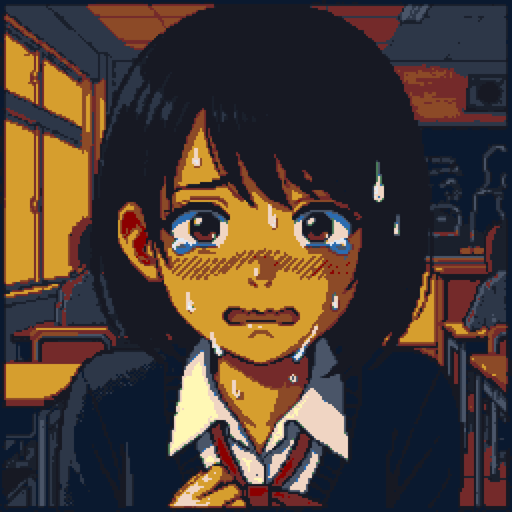

# 🌻 金城 向日葵（かねしろ ひまわり）

第2章「夏」の主人公。18歳。輝かしい青春の絶頂から、不運の連鎖で破滅する。明るく健康的で、誰もが憧れる学校の人気者。

4人の中で唯一、**破綻の引き金が「強制」でも「自発」でもなく「偶然」**である。誰かに仕組まれたわけでも、自ら望んだわけでもない事故が、最も無防備な人間を直撃する。

---

## 🎭 顔

| 項目 | 設定 |
| :--- | :--- |
| **髪** | 黒髪のショートヘア。少し丸みのあるカット |
| **目** | 大きく明るい瞳。表情変化が豊か |
| **顔立ち** | 太陽のように明るい笑顔 |
| **赤面・生理表現** | 耳たぶから首筋、胸元まで**鮮血のように大赤面**する |

## 🦴 肉体

| 項目 | 設定 |
| :--- | :--- |
| **身長・等身** | 170cm / 7.0頭身。4人中最も高い |
| **体型** | スレンダーだが胸・臀部に立体感のある健康美。水泳で作られた身体 |

## 👗 服装

### 通常時

| 部位 | 設定 |
| :--- | :--- |
| **トップス** | 鮮やかな黄色の長袖ボタンアップシャツ。**襟元のボタンを外し、袖を軽やかに捲る** |
| **ボトムス** | ライトウォッシュのブルーデニムジーンズ |
| **靴** | 履き込んだ白のスポーツスニーカー（紐・ソールに汚れ） |
| **小物** | ネイビーのナイロン製スクールバッグ |

### 下着・レッグウェア

| 部位 | 設定 |
| :--- | :--- |
| **下着** | オリーブグリーンのスポーティなインナー上下セット（陸上用セパレート風ブラ＆ショーツ） |
| **レッグウェア** | 白の普通のショートソックス。飾り気のない実用品 |

> [!tip] 4人の中での位置
> 唯一「魅せるための下着」を持たない。**機能一辺倒**であることが、視線に依存しているという内面の欠落と裏腹の関係にある。見られる自分を意識しているのに、見られない場所には無頓着。

### 破綻時

放課後の西日が差し込む教室。脱ぎ捨てられた黄色いシャツ。濡れた裸足で机の上に立たされる。

## 😶 表情パターン

共通定義は [[characters/index|キャラクター一覧]] を参照。

| パターン | 向日葵の描き分け |
| :--- | :--- |
| **通常** | 明るく健康的な笑顔 |
| **抑圧・冷や汗** | 耳を隠すように首をすくめる |
| **狼狽・大赤面** | **顔全体が激しい真っ赤**と涙目 |
| **虚脱・完全適応** | 恥辱の果てに自ら身を晒す放心の笑顔 |

---

## 🗣️ 声・話し方

（未定義）

## 🤝 人物相関

（未定義）

## 🎞️ 章別の登場

（未定義）

## 🏠 生活背景

（未定義）

---

## 📉 心理的軌道と崩壊プロセス

### 1. 【日常】健康的な光のただ中
鮮やかな黄色いシャツを羽織り、誰もが惹きつけられる笑顔で注目の的として振る舞う。

### 2. 【破綻】太陽の羞恥
放課後の夕日が射し込む教室。遮光カーテンと窓の狭間に閉じ込められ、面前での失禁という惨劇に直面する。

### 3. 【適応】放逸への着地
隠し通すことの不可能性を前にして、視線に身を晒す安堵と放逸の中に自己を落とし込んでいく。

---

## 🖼️ 確定素材（夏の16色パレット限定）

| 立ち姿 | 大赤面 | 羞恥の限界 |
| :---: | :---: | :---: |
|  |  |  |

| 象徴アイテム | ポーズ参考 | 情感参考 |
| :---: | :---: | :---: |
|  |  |  |
| 机の上の裸足と溢れる雫 | 防衛的に身を竦めるポーズ | 耳から首筋への強烈な羞恥 |

`himawari_emotion_blush_base.jpg` は**全キャラ共通のポーズ参照**として、ControlNetで俯き・赤面の構図を固定する用途に使われている。

---

## 📋 制作メモ

- 顔・肉体・服装の分離リファレンス（衣装単体・素体）は未作成
