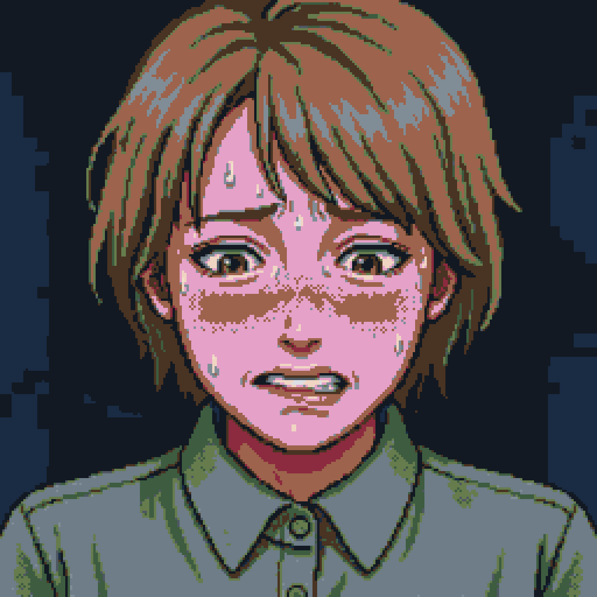
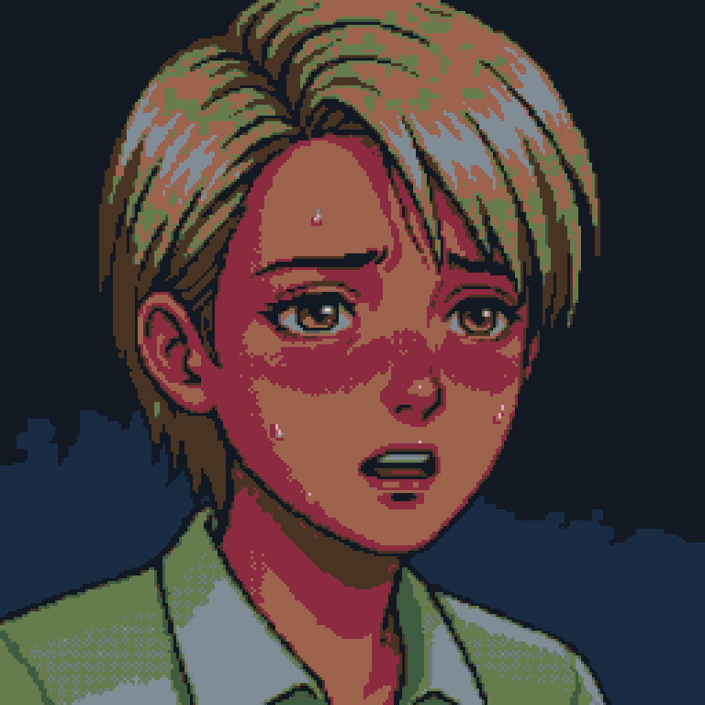
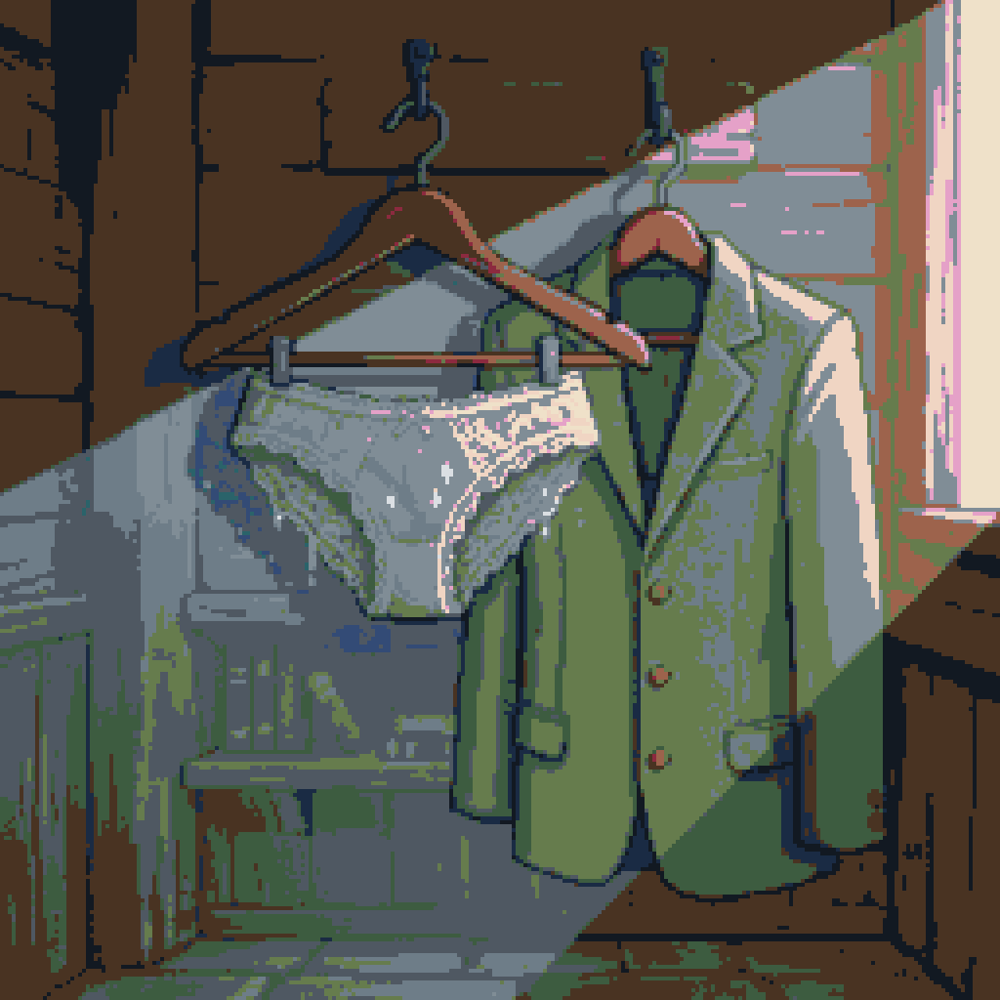

# 🌸 田邊 桃香（たなべ ももか）

『THE FOUR SEASONS』全体を貫く**経糸**であり、第1章および第5章（終章）の主人公。正義と高潔を軸に生きる23歳の新任英語教師が、理不尽な罠に落ちていく。

皺一つないブラウスを第一ボタンまで留める潔癖さと、その下に巻いた薄手の腹巻き。**外に見せる完璧さと、見えない場所の生活感**が同居しているのがこの人物の造りで、それがそのまま崩壊の構造になる。

---

## 🎭 顔

| 項目 | 設定 |
| :--- | :--- |
| **髪** | 明るいブラウンベージュのショートボブ。額が自然に見えるすっきりとした形 |
| **目** | 明るく温かみのあるブラウンの瞳 |
| **顔立ち** | 知的で整い、親しみやすく優しい。眉は知的で柔らかい |
| **赤面・生理表現** | 額を冷や汗が伝い、頬から首筋にかけてジワジワと赤面する |

## 🦴 肉体

| 項目 | 設定 |
| :--- | :--- |
| **身長・等身** | 160cm / 7.5頭身。すらりとした立ち姿 |
| **体型** | 華奢すぎず引き締まった、均整の取れた体躯 |

## 👗 服装

### 通常時

| 部位 | 設定 |
| :--- | :--- |
| **トップス** | 皺一つない薄いオリーブセージグリーンの長袖ブラウス。**一番上のボタンまで留める** |
| **ボトムス** | ダークチャコールグレーのハイウエスト・トラウザー |
| **靴** | ダークグレーのパンプス |

### 下着・レッグウェア

| 部位 | 設定 |
| :--- | :--- |
| **下着** | 淡いグリーン（薄緑）の繊細なレース上下セット |
| **レッグウェア** | ベージュの浅履きフットカバー（スラックスに隠れる） |
| **インナー** | **薄手のコットン腹巻きを常時着用**。極度の寒がりゆえ |

> [!tip] 腹巻きが担うもの
> 潔癖な外見の下に隠された、生活感のある防御。**見せる服が完璧であるほど、見えない層の泥臭さが効いてくる**。

### 破綻時・終盤

| 部位 | 状態 |
| :--- | :--- |
| **スーツ** | 完璧に着こなしたまま、服の下で静かに広がる湿り気と噴き出す冷や汗 |
| **下着** | 薄緑のレースショーツ ➔ 尿漏れパッド ➔ **動物柄の児童用おむつ** |

## 😶 表情パターン

共通定義は [[characters/index|キャラクター一覧]] を参照。

| パターン | 桃香の描き分け |
| :--- | :--- |
| **通常** | 凛とした整った教師の顔 |
| **抑圧・冷や汗** | 唇を噛み締め、オリーブの襟元まで汗 |
| **狼狽・大赤面** | 顔全体が朱に染まり、視線が失落する |
| **虚脱・完全適応** | 光のない虚ろな瞳で、安堵のおむつ微笑み |

---

## 🗣️ 声・話し方

（未定義）

## 🤝 人物相関

（未定義）

## 🎞️ 章別の登場

（未定義）

## 🏠 生活背景

（未定義）

---

## 📉 心理的軌道と崩壊プロセス

### 1. 【予兆】第1章「春」
生徒を守るという大義名分のもと、政治家たちの蠢く会議室に呼び出される。潔癖な誇りを抱えながらも、じわじわと逃げ場を失っていく。

### 2. 【決壊と変質】インサート幕
会議室の扉の前で絶対的な敗北と失禁を強いられる。その後、恐怖と屈辱を隠すために学校では「強権的な教師」として振る舞い始めるが、尿漏れパッドの着用から徐々にエスカレートしていく。

### 3. 【完全適応】第5章「再び春」
秘密を追及する男子生徒の前で、隠していた手がどけられ、動物柄の「児童用おむつ」を身につけているという最後の秘密が暴かれる。尊厳が死滅し、被支配の安堵の中で完全な適応を果たす。

> [!important] 柊との差別化
> おむつは**桃香の記号**。こちらは*他者に強制された罰*であり、[[characters/tachibana-hiiragi|橘 柊]] の*自分で選んだ擬態*とは主体も動機も正反対に置かれる。

---

## 🖼️ 確定素材（春の16色パレット限定）

| 抑圧 | 崩壊 | 象徴アイテム |
| :---: | :---: | :---: |
|  |  |  |
| 会議室で唇を噛み締め耐える | 決壊直後、瞳から光が消え耳まで赤く放心 | 木製ハンガーの濡れた薄緑ショーツとオリーブスーツ |

**その他**：`momoka_sprite_fullbody_16c.png`（立ち姿）／`momoka_expr_blush_16c.png`（大赤面）。原画は `characters/momoka/` 配下の各フォルダ

---

## 📋 制作メモ

- 顔・肉体・服装の分離リファレンス（衣装単体・素体）は未作成
