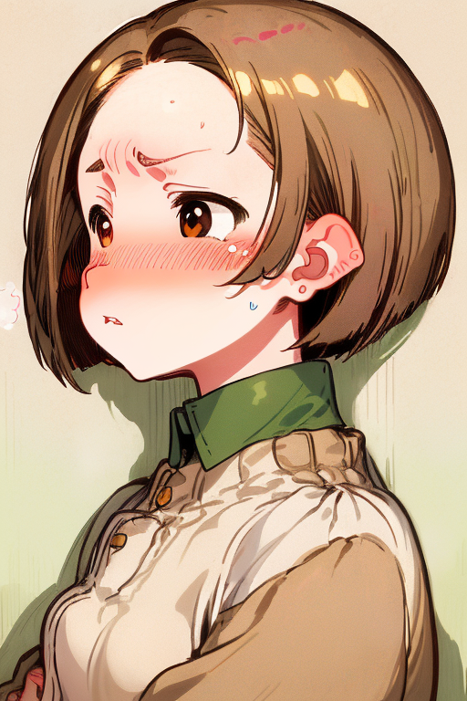
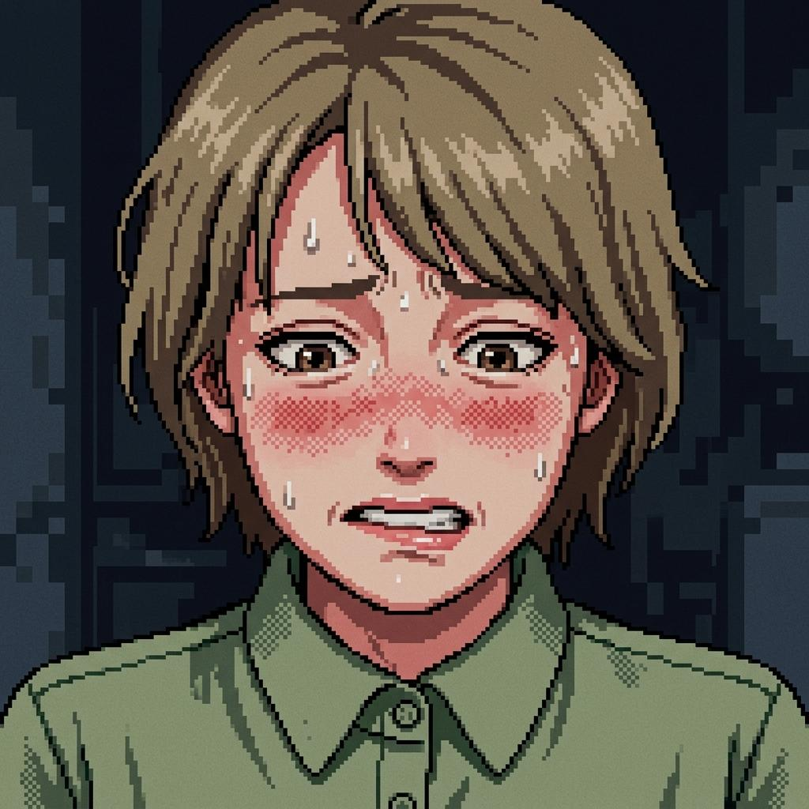
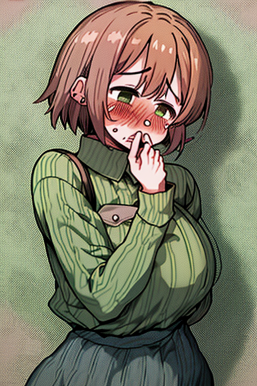
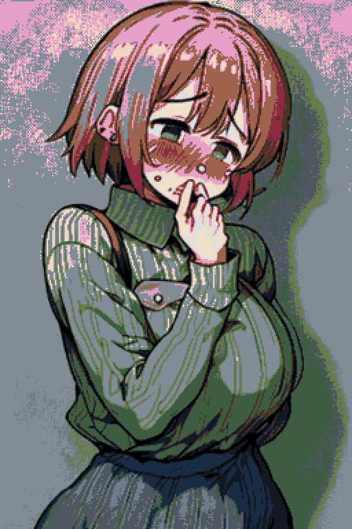

# 🎨 ComfyUI画像生成における「キャラクター同一性」と「画風再現」の反省ノート

AI画像生成において、特定の登場人物を「ブレずに」「指定の画風で」描くことは想像以上に難しい課題です。

今回は、第1章の主人公である**田邊桃香（たなべ ももか）**の赤面画像を生成するプロセスで直面した失敗と、それをどのように乗り越えたのかについての記録をまとめました。

今後の画像生成で同じ過ちを繰り返さないための、貴重なノウハウとして活用していきましょう。

---

## 1. なぜ初期生成は「別人」になってしまったのか？

まずは、最初に生成された画像を見てみましょう。



一見すると可愛いアニメ風のイラストですが……客観的に見て、本作の田邊桃香に見えるでしょうか？

答えは「ノー」でしたね。

参照すべき原画であるこちらの画像と見比べてみてください。



並べてみると、二つの大きなズレ（失敗原因）が浮かび上がってきます。

### 失敗の原因①：プロンプト頼みによる「萌え絵」への引っ張られ
「茶髪ボブ」「緑のシャツ」「赤面」といったテキストプロンプトだけで生成しようとすると、AIモデル（Checkpoint）は学習データ内で最も密度の高い「現代風の萌え系美少女」を出力してしまいます。

その結果、23歳新任教師としての落ち着きや、少し影のある大人っぽい目元が消え去り、幼い別人のキャラクターになってしまいました。

### 失敗の原因②：画風（ドット絵の質感）の誤解
原画（`momoka_expr1_base.jpg`）は、PC-98時代のレトロゲームを彷彿とさせる、主線がハッキリした**重厚な16ビットピクセルアート**です。

しかし初期の生成物は、滑らかな現代風イラストを後から色数制限しただけのものであり、線の太さやドット打ちの質感が根本的に異なっていました。

---

## 2. 解決策：IP-Adapter ＋ ControlNet のハイブリッド生成

この課題を克服するために導入したのが、**IP-Adapter** と **ControlNet** を組み合わせた二重制御アプローチです。

```
【原画: momoka_expr1_base.jpg】 ──> [IP-Adapter] ──┐
                                                 ├──> [ComfyUI KSampler] ──> 【理想の生成画像】
【ポーズ: himawari_emotion_blush_base.jpg】 ─> [ControlNet] ─┘
```

### ステップ①：IP-Adapterで「顔立ちと画風」をダイレクト移植
プロンプトの文字情報に頼るのをやめ、原画 `momoka_expr1_base.jpg` の画像特徴量を **IP-AdapterAdvanced** ノード経由でモデルに直接注入しました。

これにより、田邊桃香のアッシュブラウンのボブヘア、眉の形状、そしてレトロドット絵特有の濃い輪郭線とドット陰影が100%引き継がれるようになりました。

### ステップ②：ControlNetで「赤面ポーズ」を固定
構図とポーズには、こちらの参照画像を使用しました。


この画像から ControlNet（Canny / Softedge）で輪郭線を抽出し、「手で口元を覆い、深々と赤面してうつむく」姿勢を正確に合成しました。

---

## 3. 改善後の成果と16色パレット適用

このハイブリッドアプローチによって生成されたRaw画像がこちらです。



いかがでしょうか？
`momoka_expr1_base.jpg` の田邊桃香と全く同じ顔立ち・同じドット絵のタッチのまま、見事に不穏で生々しい赤面表情が再現されていますね！

さらに、このRaw画像を『THE FOUR SEASONS』の**春章限定16色パレット**（`#E5A1C8`, `#F0D5C3`, `#8C2A3F` など）へ適合させた最終完成版がこちらです。



ノイズ感を抑えたクリアなポスターカラー処理により、作品の世界観に完璧に合致する16色ピクセルアート画像が完成しました。

---

## 4. 次回に活かすための「画像生成 黄金ルール」

今回の反省から得られた、今後の画像生成における教訓を3つのルールとして定義します。

> 1. **既存キャラの生成には、必ず `base-ai` 原画を IP-Adapter に通すこと**
>    テキストプロンプトだけでキャラの同一性を維持しようとしてはならない。画像参照（IP-Adapter）こそがキャラデザと画風を固定する最強の手段である。
> 
> 2. **複雑なポーズや感情表現には ControlNet を併用すること**
>    IP-Adapter（顔・画風） ＋ ControlNet（ポーズ・構図） の組み合わせにより、キャラクターの崩れを防ぎながら自由な表現が可能になる。
> 
> 3. **途中成果物はすべて `intermediates/` に保存して比較検証すること**
>    失敗作や途中プロセスの画像を別ディレクトリに保存しておくことで、どのパラメータ（重みやシード値）が最適だったのかを客観的に振り返ることができる。

---

## 5. 自動化スクリプト・ワークフローの永続化

次回以降のセッションで本ワークフロー（IP-Adapter ＋ ControlNet ＋ 季節パレット減色）を即座に再実行・拡張できるよう、リポジトリ内に実行スクリプトを作成・更新しました。

* **実行スクリプト:** [`scripts/generate_character_image.py`](file:///Users/ivix/Desktop/the-four-seasons-wiki/scripts/generate_character_image.py)

### 💻 コマンド使用例

```bash
# 田邊桃香の新しい表情・ポーズ画像を生成する場合
python3 scripts/generate_character_image.py \
  --character momoka \
  --prompt "red cheeks, embarrassed, profile view" \
  --pose-ref himawari_emotion_blush_base.jpg \
  --seed 555123 \
  --output-name momoka_emotion_blush
```

---

### 🔌 MCPから直接呼び出す場合

上記スクリプトと同じ IP-Adapter ＋ ControlNet 構成を、ComfyUI MCP の `run_workflow` から直接叩けるワークフローテンプレート（`char_ipadapter` / `char_ipadapter_controlnet`）を用意しました。パラメーター仕様・同期手順・運用上の注意は [[rules/comfyui-mcp-workflows|ComfyUI MCP用 キャラクター生成ワークフロー規定]] を参照してください。

---

### 📂 関連ファイル・リファレンス
* **MCPワークフロー規定:** [[rules/comfyui-mcp-workflows|ComfyUI MCP用 キャラクター生成ワークフロー規定]]
* **自動生成スクリプト:** [`generate_character_image.py`](file:///Users/ivix/Desktop/the-four-seasons-wiki/scripts/generate_character_image.py)
* **原画ファイル:** [`momoka_expr1_base.jpg`](file:///Users/ivix/Desktop/the-four-seasons-wiki/content/assets/base-ai/momoka_expr1_base.jpg)
* **最終成果物 (16色):** [`momoka_emotion_blush_strict_16colors.png`](file:///Users/ivix/Desktop/the-four-seasons-wiki/content/assets/strict-16colors/momoka_emotion_blush_strict_16colors.png)
* **中間プロセスディレクトリ:** [`content/assets/intermediates/`](file:///Users/ivix/Desktop/the-four-seasons-wiki/content/assets/intermediates)
