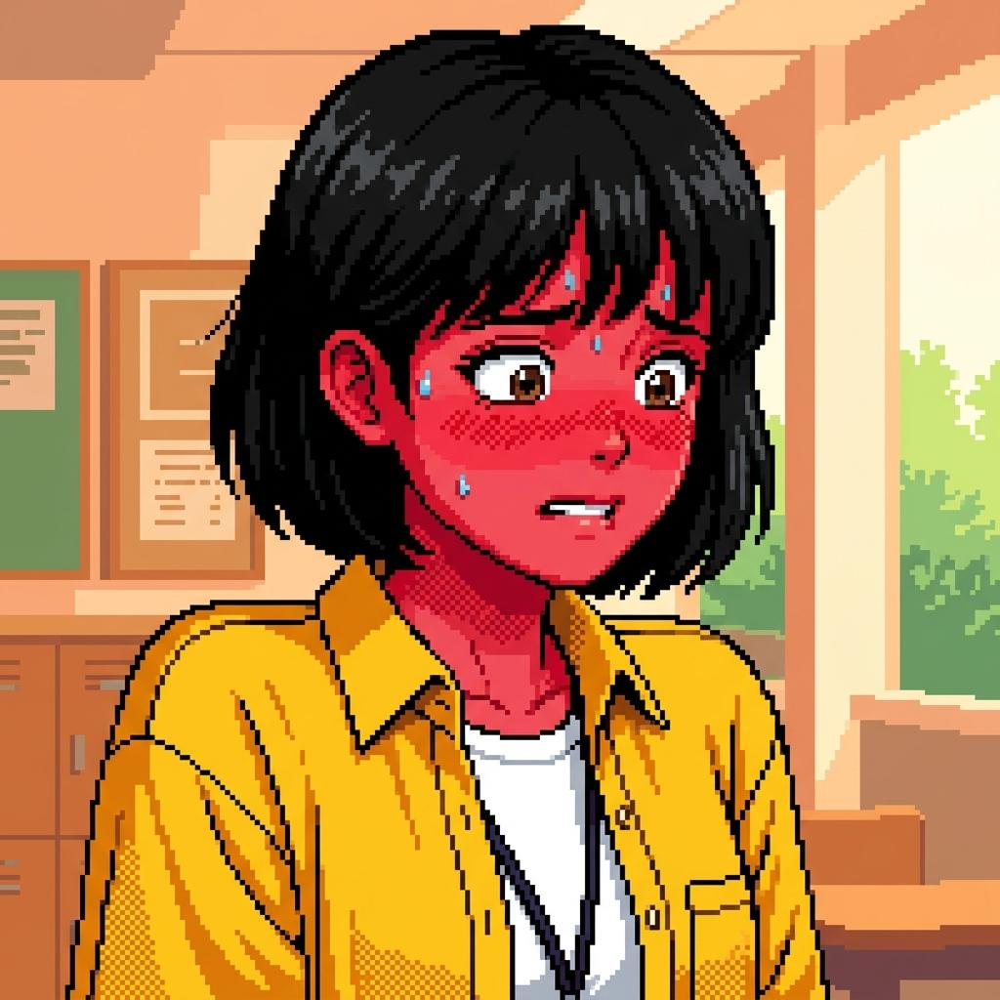
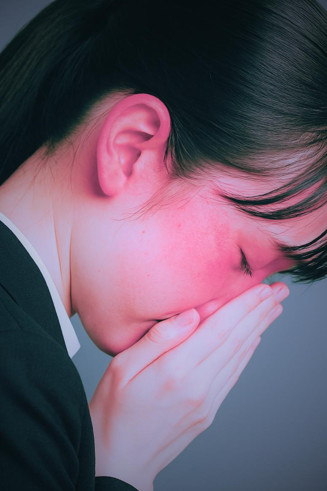
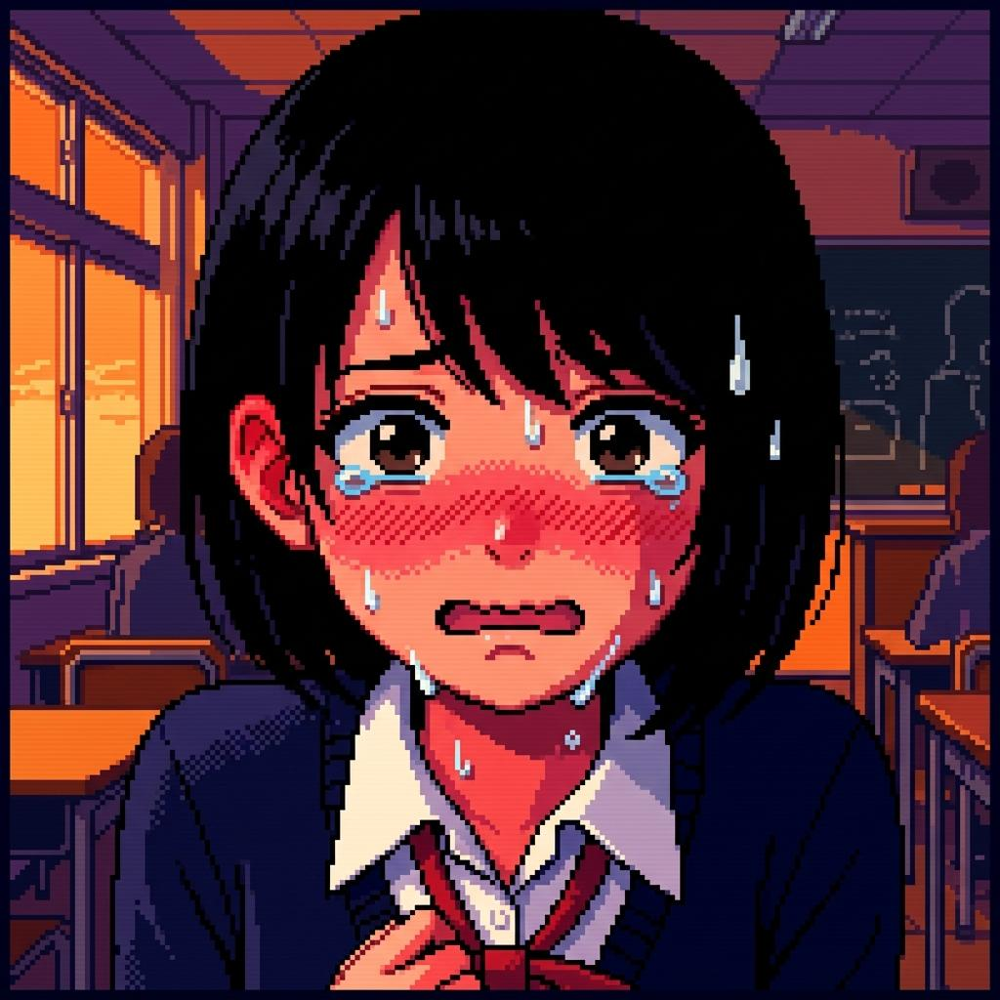

# 🌻 金城 向日葵 表情設定：6段階

> [!abstract] この人物の表情設計
> **コントラスト:** 弱め（上から3番目）
> **4人中もっとも表情の可動域が広い。**大きく丸い瞳と太めの眉が、段階1と段階5の落差を最大化する。青みの白い肌の上では**頬の円形の赤面だけが突出する**ので、赤面は輪郭をぼかさず円形に。
> **段階の進み方:** 段階2（笑顔）から段階5（狼狽）へ**3をほぼ飛ばして落ちる**のが向日葵だけの経路。破綻が偶然の事故であるため、警戒する時間が与えられない。

共通の6段階定義は [[characters/index#😐 表情：全キャラ共通の6段階定義|キャラクター一覧]] を参照。
プロンプトは `workflows/character_prompt_spec.json` から生成した**写し**。食い違った場合はspecが正。

---

## 1. 通常（Neutral）

| 項目 | 内容 |
| :--- | :--- |
| **定義** | ペルソナを維持した日常の顔 |
| **発生タイミング** | 章の序盤・日常会話・社会的対応 |
| **状態** | `open` — 画像未生成 |

| 参照画像 | 意図 |
| :---: | :--- |
|  | **`open`／未生成。**バストアップ・正面・無地背景。ペルソナを維持した日常の顔を、上記「この人物の表情設計」の方針で描き分けたもの。6枚は**同一の構図・光・距離**で揃えること（並べて比較するため）。 |

```text
18yo japanese high school girl, cheerful and popular, tall curvy athletic build, 170cm, long soft dark brown to black wavy hair with a bluish cast, bangs down, unstyled, large round eyes, wide double eyelids, big dark irises, expressive, bright open expression, large round eyes fully visible, thick brows level, mouth in an easy line, bust-up portrait, head and shoulders, facing viewer, plain neutral background, even soft lighting, cool summer palette, low contrast, pale bluish skin
```

## 2. 笑顔・安堵（Smile）

| 項目 | 内容 |
| :--- | :--- |
| **定義** | 魅せる笑顔、または一過性の安堵 |
| **発生タイミング** | 良好な他者対応・危機を脱した錯覚 |
| **状態** | `open` — 画像未生成 |

| 参照画像 | 意図 |
| :---: | :--- |
|  | **`open`／未生成。**バストアップ・正面・無地背景。魅せる笑顔、または一過性の安堵を、上記「この人物の表情設計」の方針で描き分けたもの。6枚は**同一の構図・光・距離**で揃えること（並べて比較するため）。 |

```text
18yo japanese high school girl, cheerful and popular, tall curvy athletic build, 170cm, long soft dark brown to black wavy hair with a bluish cast, bangs down, unstyled, large round eyes, wide double eyelids, big dark irises, expressive, wide unguarded grin, eyes crinkling almost shut, cheeks lifted, radiant and careless, bust-up portrait, head and shoulders, facing viewer, plain neutral background, even soft lighting, cool summer palette, low contrast, pale bluish skin
```

## 3. 警戒・違和感（Suspicion）

| 項目 | 内容 |
| :--- | :--- |
| **定義** | 異変や周囲の視線を察知 |
| **発生タイミング** | 罠の気配・逃げ場の喪失の予感 |
| **状態** | `open` — 画像未生成 |

| 参照画像 | 意図 |
| :---: | :--- |
|  | **`open`／未生成。**バストアップ・正面・無地背景。異変や周囲の視線を察知を、上記「この人物の表情設計」の方針で描き分けたもの。6枚は**同一の構図・光・距離**で揃えること（並べて比較するため）。 |

```text
18yo japanese high school girl, cheerful and popular, tall curvy athletic build, 170cm, long soft dark brown to black wavy hair with a bluish cast, bangs down, unstyled, large round eyes, wide double eyelids, big dark irises, expressive, round eyes going still, thick brows knitting, smile draining away mid-expression, head tilting back slightly, bust-up portrait, head and shoulders, facing viewer, plain neutral background, even soft lighting, cool summer palette, low contrast, pale bluish skin
```

## 4. 抑圧・冷や汗（Anxiety）

| 項目 | 内容 |
| :--- | :--- |
| **定義** | 生理的緊張・破綻の隠蔽 |
| **発生タイミング** | 耐えている最中 |
| **状態** | `done` — 既存参照あり |

| 参照画像 | 意図 |
| :---: | :--- |
|  | 眉が角度を増し、額に冷や汗が浮かぶ。必死に噛み締める唇。 |

```text
18yo japanese high school girl, cheerful and popular, tall curvy athletic build, 170cm, long soft dark brown to black wavy hair with a bluish cast, bangs down, unstyled, large round eyes, wide double eyelids, big dark irises, expressive, brows steeply angled, cold sweat at the hairline, teeth clamped on the lower lip, big eyes darting, breath held, bust-up portrait, head and shoulders, facing viewer, plain neutral background, even soft lighting, cool summer palette, low contrast, pale bluish skin
```

## 5. 狼狽・大赤面（Panic）

| 項目 | 内容 |
| :--- | :--- |
| **定義** | 破綻の瞬間・激しい羞恥 |
| **発生タイミング** | 露出・失禁の直前〜直後 |
| **状態** | `done` — 既存参照あり |

| 参照画像 | 意図 |
| :---: | :--- |
|  | 頬中央に鮮烈な円形の赤面。涙目の瞳、崩れた眉。 |

```text
18yo japanese high school girl, cheerful and popular, tall curvy athletic build, 170cm, long soft dark brown to black wavy hair with a bluish cast, bangs down, unstyled, large round eyes, wide double eyelids, big dark irises, expressive, violent circular blush on both cheeks spreading to the collarbone, eyes enormous and streaming, mouth wide open, brows collapsed, bust-up portrait, head and shoulders, facing viewer, plain neutral background, even soft lighting, cool summer palette, low contrast, pale bluish skin
```

## 6. 虚脱・完全適応（Acceptance）

| 項目 | 内容 |
| :--- | :--- |
| **定義** | 尊厳の死滅と被支配への安堵 |
| **発生タイミング** | 屈服・完全適応の結末 |
| **状態** | `done` — 既存参照あり |

| 参照画像 | 意図 |
| :---: | :--- |
|  | 光の消えた大きな瞳。微かな諦念の笑み。 |

```text
18yo japanese high school girl, cheerful and popular, tall curvy athletic build, 170cm, long soft dark brown to black wavy hair with a bluish cast, bangs down, unstyled, large round eyes, wide double eyelids, big dark irises, expressive, large eyes emptied of light, staring past the viewer, mouth hanging slightly open, faint bewildered smile, tear tracks drying, bust-up portrait, head and shoulders, facing viewer, plain neutral background, even soft lighting, cool summer palette, low contrast, pale bluish skin
```

---

## 🔁 再生成

```bash
python3 -c "import json;s=json.load(open('workflows/character_prompt_spec.json'));c=s['characters']['kaneshiro-himawari'];[print(k,':',', '.join([c['slots']['subject'],c['slots']['hair'],c['slots']['eyes'],v,s['expression_framing'],c['slots']['tone']]),'\n') for k,v in c['expression_slots'].items()]"
```

**ネガティブプロンプト（共通）:** `worst quality, low quality, bad anatomy, bad hands, missing limbs, extra limbs, cropped, text, watermark, signature, jpeg artifacts, blurry`
