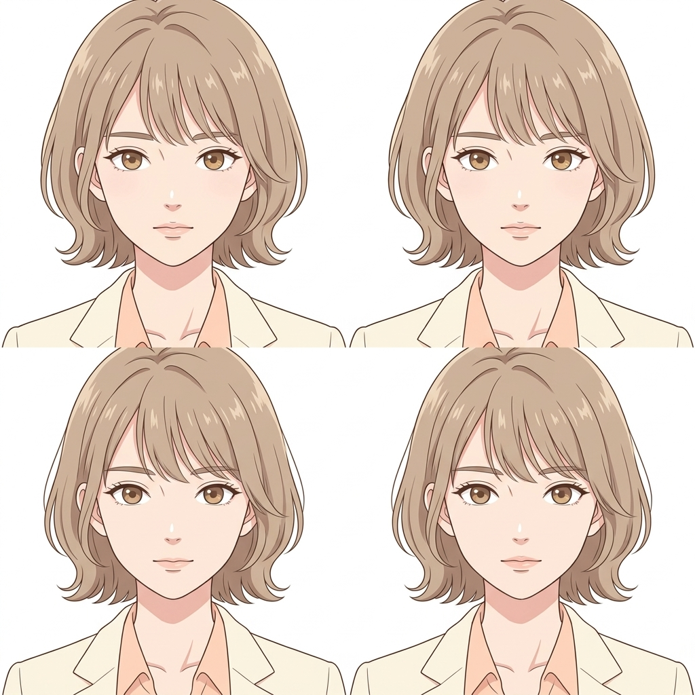
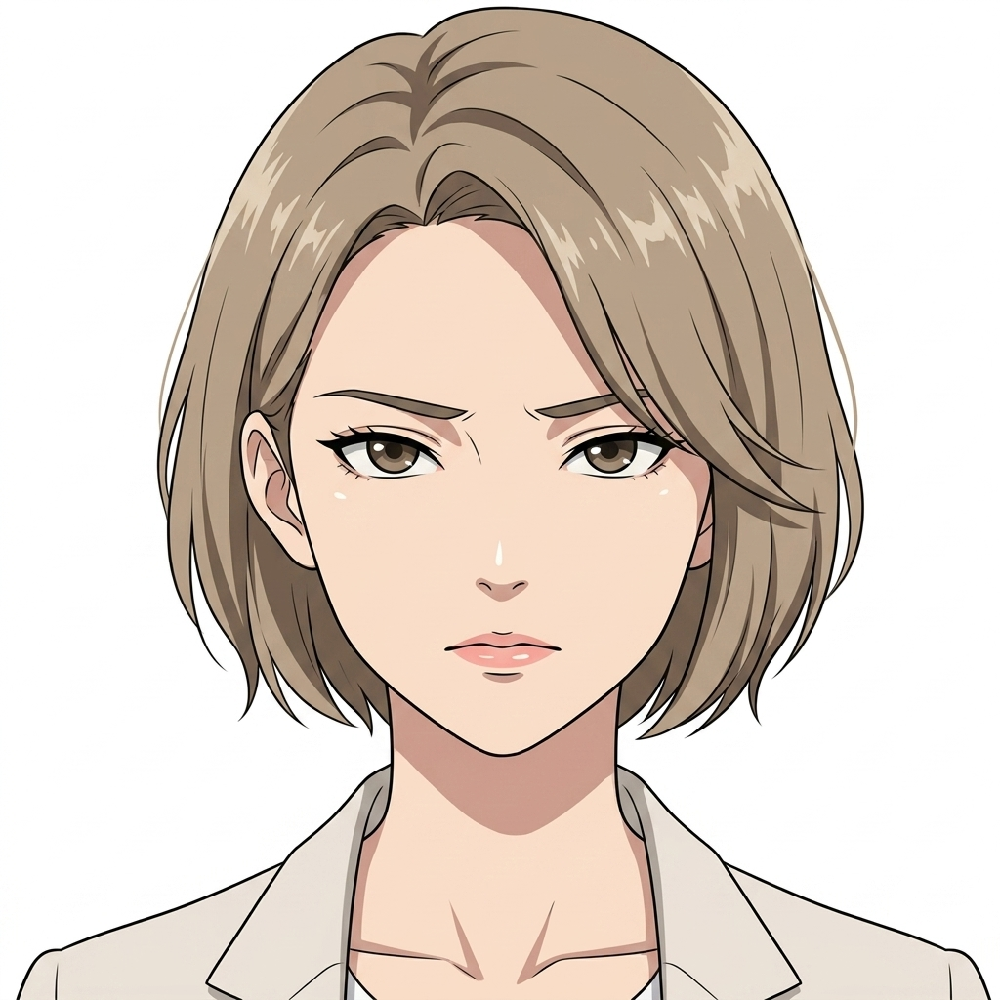
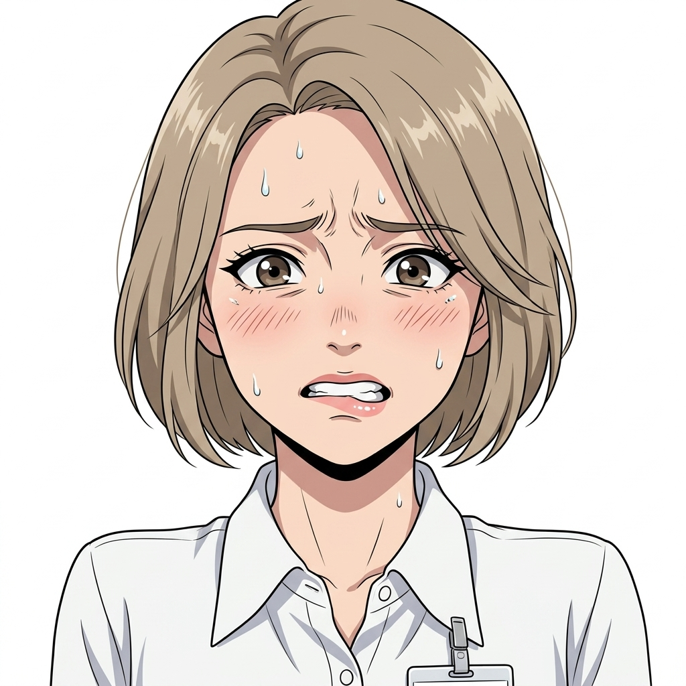
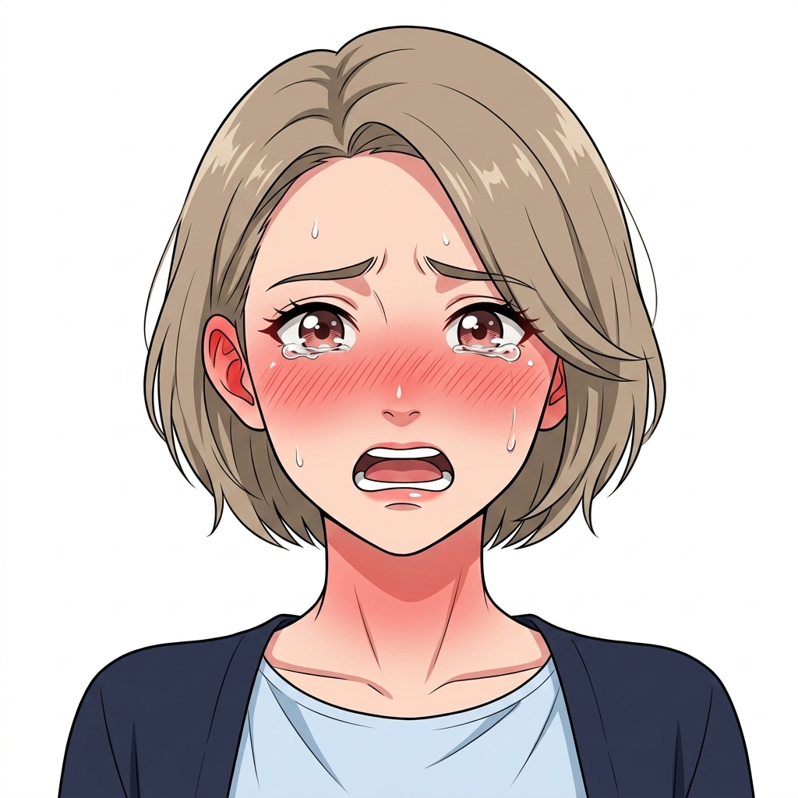
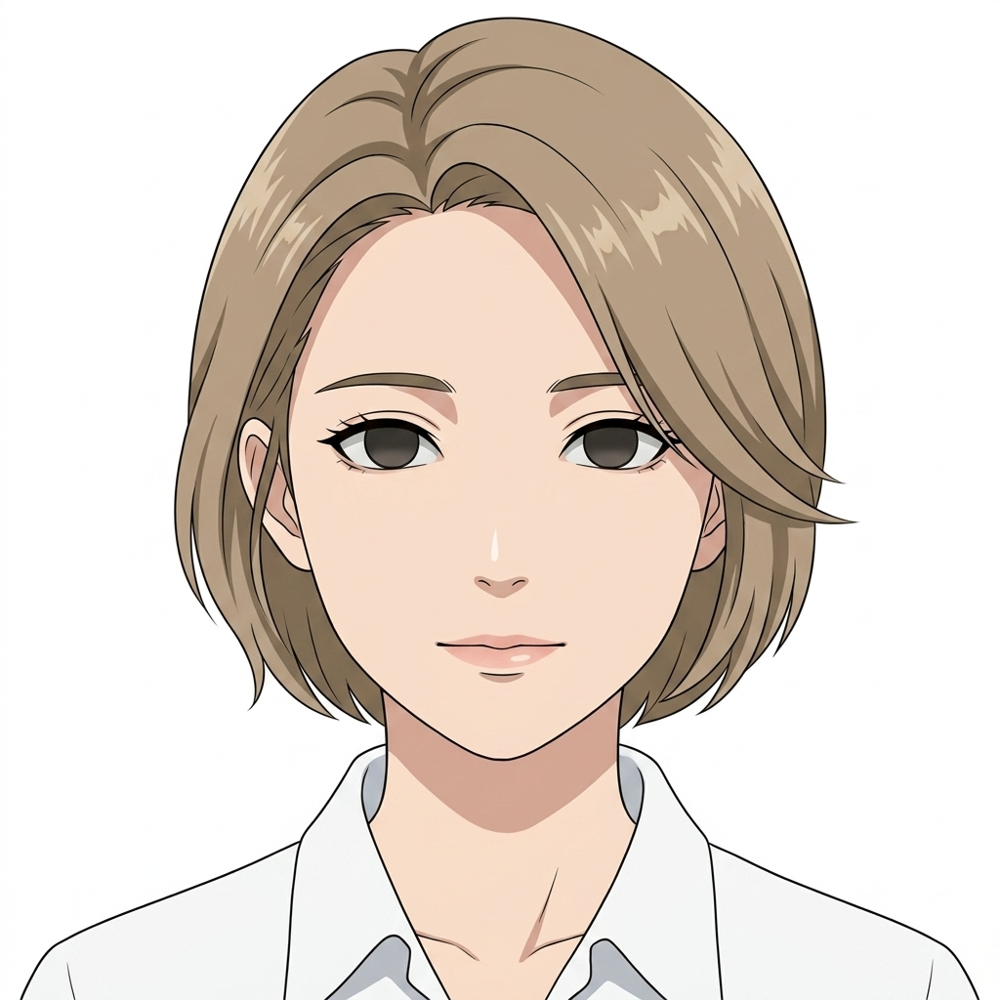

# 🌸 田邊 桃香 表情設定：6段階

> [!abstract] この人物の表情設計
> **コントラスト:** 4人中もっとも弱い
> **低コントラストゆえ、変化が出にくい。**明るい髪・明るい瞳・淡い肌が近い明度で並ぶため、段階4〜5の冷や汗と赤面は**面積ではなく密度**で描く。額の汗粒を大きく、赤面は耳から首筋という細い帯に集中させる。
> **段階の進み方:** 段階3（警戒）が最も長い。罠と気づいてから落ちるまでに猶予があるのが桃香だけの特徴で、その間ずっと4を隠している。

共通の6段階定義は [[characters/index#😐 表情：全キャラ共通の6段階定義|キャラクター一覧]] を参照。

---

## 1. 通常（Neutral）

| 項目 | 内容 |
| :--- | :--- |
| **定義** | ペルソナを維持した日常の顔 |
| **発生タイミング** | 章の序盤・日常会話・社会的対応 |
| **状態** | `done` — 生成完了 |

| 参照画像 | 意図 |
| :---: | :--- |
|  | 凛とした整った教師の顔。ペルソナを維持した日常の佇まい。 |

```text
23yo japanese woman, novice high school english teacher, slender petite build, 160cm, short light brown-beige hair, shortest of the four, wispy see-through bangs, flipped-out ends, forehead visible, inner double eyelids, bright light brown irises, straight thin eyebrows, composed dignified gaze, calm composed expression, straight thin eyebrows level, lips lightly closed, upright dignified gaze, bust-up portrait, head and shoulders, facing viewer, plain neutral background, even soft lighting, warm spring palette, lowest contrast of the four, soft daylight
```

## 2. 笑顔・安堵（Smile）

| 項目 | 内容 |
| :--- | :--- |
| **定義** | 魅せる笑顔、または一過性の安堵 |
| **発生タイミング** | 良好な他者対応・危機を脱した錯覚 |
| **状態** | `done` — 生成完了 |

| 参照画像 | 意図 |
| :---: | :--- |
|  | 柔らかく温かみのある教員らしい微笑み。安堵と信頼の表情。 |

```text
23yo japanese woman, novice high school english teacher, slender petite build, 160cm, short light brown-beige hair, shortest of the four, wispy see-through bangs, flipped-out ends, forehead visible, inner double eyelids, bright light brown irises, straight thin eyebrows, composed dignified gaze, gentle small smile, eyes softening into a slight crease, brows relaxed, warm and teacherly, bust-up portrait, head and shoulders, facing viewer, plain neutral background, even soft lighting, warm spring palette, lowest contrast of the four, soft daylight
```

## 3. 警戒・違和感（Suspicion）

| 項目 | 内容 |
| :--- | :--- |
| **定義** | 異変や周囲の視線を察知 |
| **発生タイミング** | 罠の気配・逃げ場の喪失の予感 |
| **状態** | `done` — 生成完了 |

| 参照画像 | 意図 |
| :---: | :--- |
|  | 目元がわずかに狭まり、薄い眉が低く直線的に引き締まる。異変の察知。 |

```text
23yo japanese woman, novice high school english teacher, slender petite build, 160cm, short light brown-beige hair, shortest of the four, wispy see-through bangs, flipped-out ends, forehead visible, inner double eyelids, bright light brown irises, straight thin eyebrows, composed dignified gaze, eyes narrowing slightly, brows drawing straighter and lower, lips pressed thin, gaze flicking sideways, bust-up portrait, head and shoulders, facing viewer, plain neutral background, even soft lighting, warm spring palette, lowest contrast of the four, soft daylight
```

## 4. 抑圧・冷や汗（Anxiety）

| 項目 | 内容 |
| :--- | :--- |
| **定義** | 生理的緊張・破綻の隠蔽 |
| **発生タイミング** | 耐えている最中 |
| **状態** | `done` — 生成完了 |

| 参照画像 | 意図 |
| :---: | :--- |
|  | 眉が寄り、額に大きな冷や汗の粒。下唇を噛み締め耐える瞬間。 |

```text
23yo japanese woman, novice high school english teacher, slender petite build, 160cm, short light brown-beige hair, shortest of the four, wispy see-through bangs, flipped-out ends, forehead visible, inner double eyelids, bright light brown irises, straight thin eyebrows, composed dignified gaze, brows pulled together, beads of cold sweat on the forehead and temple, lower lip caught between the teeth, eyes fixed forward too hard, bust-up portrait, head and shoulders, facing viewer, plain neutral background, even soft lighting, warm spring palette, lowest contrast of the four, soft daylight
```

## 5. 狼狽・大赤面（Panic）

| 項目 | 内容 |
| :--- | :--- |
| **定義** | 破綻の瞬間・激しい羞恥 |
| **発生タイミング** | 露出・失禁の直前〜直後 |
| **状態** | `done` — 生成完了 |

| 参照画像 | 意図 |
| :---: | :--- |
|  | 耳たぶから首筋へかけての激しい大赤面。涙目の瞳と開いた口。 |

```text
23yo japanese woman, novice high school english teacher, slender petite build, 160cm, short light brown-beige hair, shortest of the four, wispy see-through bangs, flipped-out ends, forehead visible, inner double eyelids, bright light brown irises, straight thin eyebrows, composed dignified gaze, deep flush spreading from the earlobes down the neck, eyes brimming and wide, mouth fallen open, brows lifted helplessly, bust-up portrait, head and shoulders, facing viewer, plain neutral background, even soft lighting, warm spring palette, lowest contrast of the four, soft daylight
```

## 6. 虚脱・完全適応（Acceptance）

| 項目 | 内容 |
| :--- | :--- |
| **定義** | 尊厳の死滅と被支配への安堵 |
| **発生タイミング** | 屈服・完全適応の結末 |
| **状態** | `done` — 生成完了 |

| 参照画像 | 意図 |
| :---: | :--- |
|  | 瞳から光が消えた虚ろな眼差し。屈服とおむつ着用への微笑み。 |

```text
23yo japanese woman, novice high school english teacher, slender petite build, 160cm, short light brown-beige hair, shortest of the four, wispy see-through bangs, flipped-out ends, forehead visible, inner double eyelids, bright light brown irises, straight thin eyebrows, composed dignified gaze, light gone from the eyes, unfocused hollow stare, faint resigned smile, face slack, flush fading to pallor, bust-up portrait, head and shoulders, facing viewer, plain neutral background, even soft lighting, warm spring palette, lowest contrast of the four, soft daylight
```
