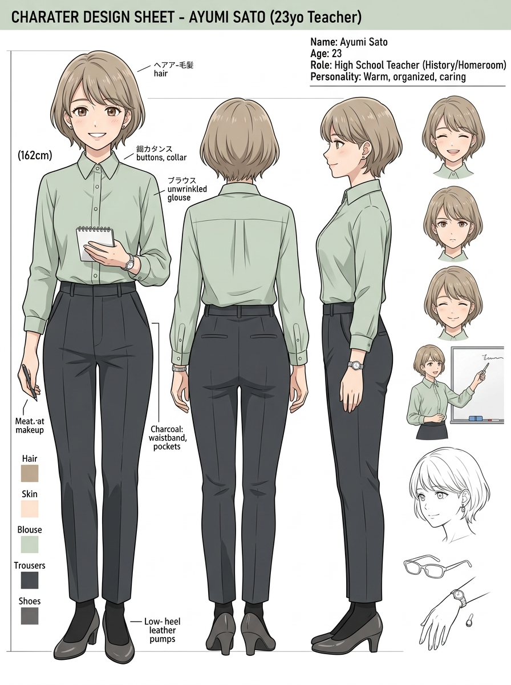
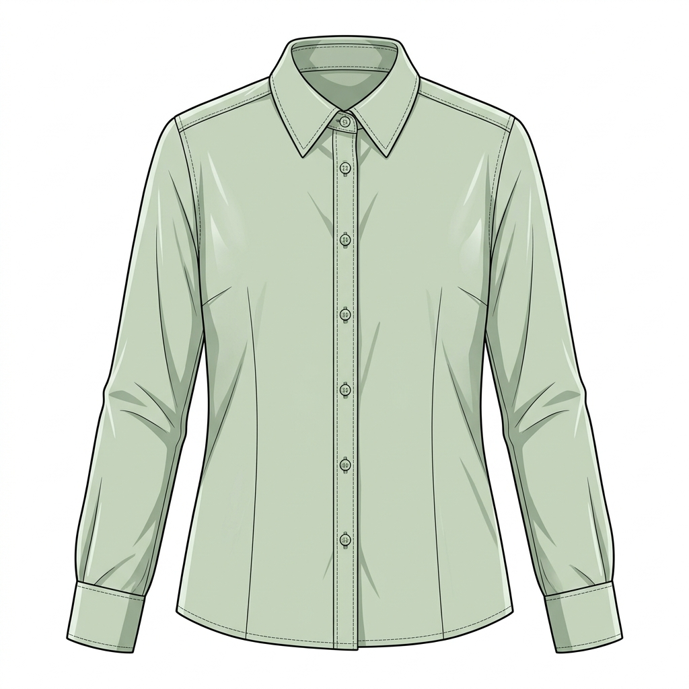
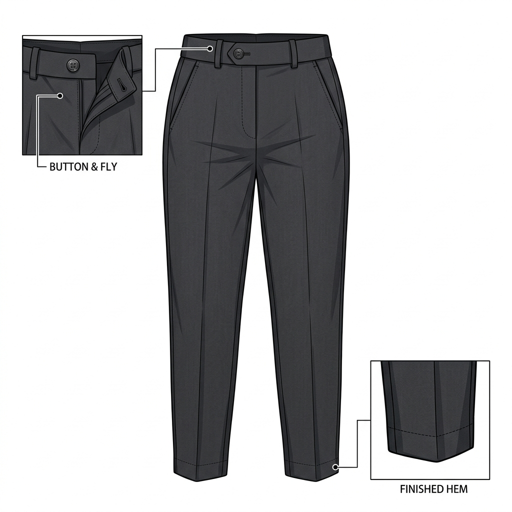
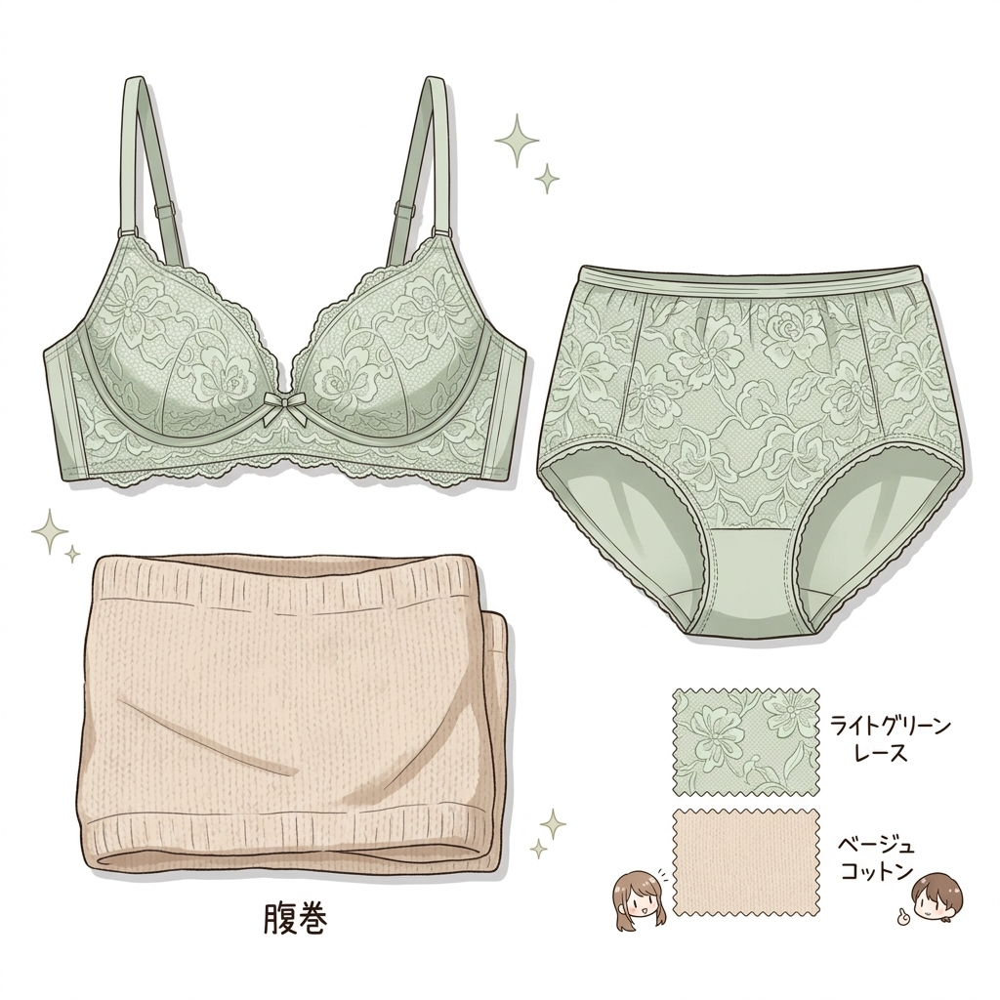

# 👗 田邊 桃香 衣装設定：新任教師スタイル & 下着・破綻変遷

> [!abstract] コンセプト概要
> **「皺一つない完璧な新任教師スタイルと、その下に秘められた生真面目な生活感」**
> 属性：春（イエベ春）／ TPO（学校・勤務）／ コントラスト（4人中最も弱い）

---

## 🖼️ 全体ビジュアル & カラーパレット

| 全体イメージ設定シート | 配色パレット | 画像生成タグ（AI Prompts） |
| :---: | :---: | :--- |
|  | `主色` #72713E オリーブセージ（ブラウス） `副色` #575757 ダークチャコール（トラウザー） `挿色` #A8AC84 薄緑（レース下着）**⚠キャラパレット外** 春情景パレットの近似色 `#667C4D`（濡れた植栽） | `23yo japanese woman, novice high school english teacher, slender petite build, 160cm, short light brown-beige hair, shortest of the four, wispy see-through bangs, flipped-out ends, forehead visible, inner double eyelids, bright light brown irises, straight thin eyebrows, composed dignified gaze, light sage green long sleeve blouse, crisp unwrinkled cotton, buttoned all the way to the collar, dark charcoal high-waist straight trousers, full length, beige no-show footcovers, dark grey low-heel pumps, warm spring palette, lowest contrast of the four, soft daylight` |

---

## 🧩 パーツ別詳細仕様

| 部位 | 実物参照イメージ | アイテム名 | 詳細仕様（素材・配色・着こなしルール） |
| :--- | :---: | :--- | :--- |
| **👕 トップス** |  | **薄緑の長袖ブラウス** | **素材:** 皺一つない上質コットン **配色:** 薄いオリーブセージグリーン **着方:** **第一ボタンまで隙なく留める**（潔癖さと自律の誇り） |
| **👖 ボトムス** |  | **ダークチャコールのトラウザー** | **丈感:** フルレングス・ストレート **ウエスト:** ハイウエスト **印象:** 凛とした教師らしい清潔なシルエット |
| **👙 インナー / 下着** |  | **淡いグリーンのレースセット ＋ コットン腹巻き** | **下着:** 薄緑の繊細なレース上下セット **隠し層:** **薄手のコットン腹巻きを常時着用**（寒がりゆえ） **意味:** 完璧な外見の裏にある生真面目な生活感の防壁 |
| **🧦 脚 / 靴** |  | **ダークグレーのパンプス & フットカバー** | **脚:** ベージュの浅履きフットカバー（スラックス下に隠れる） **靴:** ダークグレーのローヒールパンプス **意味:** 規律と足を地につけた歩み |

---

## ⚡ 物語・破綻時の変化

> [!warning] 乱れ・破綻時の変化ルール
> * **破綻の性質:** **【作為】**
> * **トリガー:** 政治家たちの密室における罠と絶対的な敗北
> * **下着の変遷:**  
>   `1. 薄緑のレースショーツ` ➔ `2. 尿漏れパッド` ➔ `3. 児童用おむつ`
> * **視覚変化:** 皺一つない完璧なブラウスを着こなしたまま、服の下で静かに広がる湿り気と額から首筋へ伝う冷や汗
> * **構造的意味:** **【潔癖の陥落】** — 完璧な自律が打ち砕かれ、おむつ着用による完全被支配への安堵と完全適応へ至る
