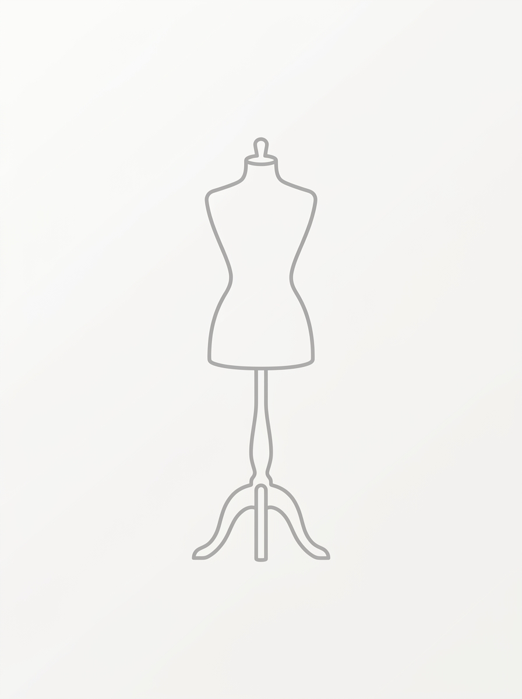

# 📍 政治家たちの密室・会議室

**登場章:** [[chapters/01-spring/index|01-spring]]　／　**決定状態:** `canon`

---

## 🧩 スロット別仕様

| スロット | 内容 |
| :--- | :--- |
| **空間** | windowless interior meeting room, heavy closed double doors, oppressively low ceiling, no visible exit |
| **表面・素材** | long polished dark wood table, deep carpet swallowing sound, leather chairs |
| **光** | recessed downlights only, cold and even, no daylight, hard shadows under the table |
| **空気・音・匂い** | stale overwarm air, no circulation, faint smell of tobacco and paper |
| **小道具** | water glasses left untouched, a closed document folder, a wall clock |
| **カメラ** | eye level, medium wide, slight wide-angle compression toward the doors |
| **トーン** | spring chapter palette, low contrast, desaturated |

---

## 🖼️ 参照画像

| 背景 | 意図 |
| :---: | :--- |
|  | **`open`／未生成。**人物を含まない背景単体。上記スロットのとおり。<br>**用途:** この場所で起きる全シーンの背景基準。キャラ画像と合成するため**カメラ設定を固定**して生成すること。 |

---

## 🎨 プロンプト

```text
windowless interior meeting room, heavy closed double doors, oppressively low ceiling, no visible exit, long polished dark wood table, deep carpet swallowing sound, leather chairs, recessed downlights only, cold and even, no daylight, hard shadows under the table, stale overwarm air, no circulation, faint smell of tobacco and paper, water glasses left untouched, a closed document folder, a wall clock, eye level, medium wide, slight wide-angle compression toward the doors, spring chapter palette, low contrast, desaturated
```

**ネガティブ:** `people, person, human, figure, worst quality, low quality, text, watermark, signature, jpeg artifacts, blurry`

> [!note] 人物は含めない
> 場所プロンプトに人物を入れないこと。シーン画像は**場所スロット＋キャラスロット**を生成時に合成して作る。

