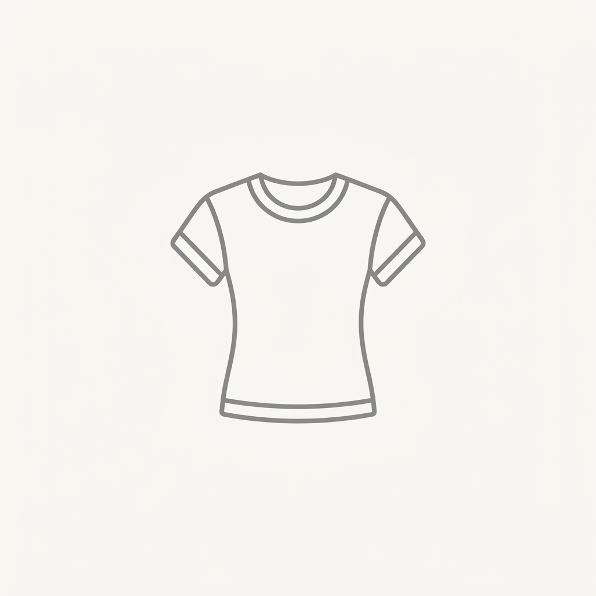
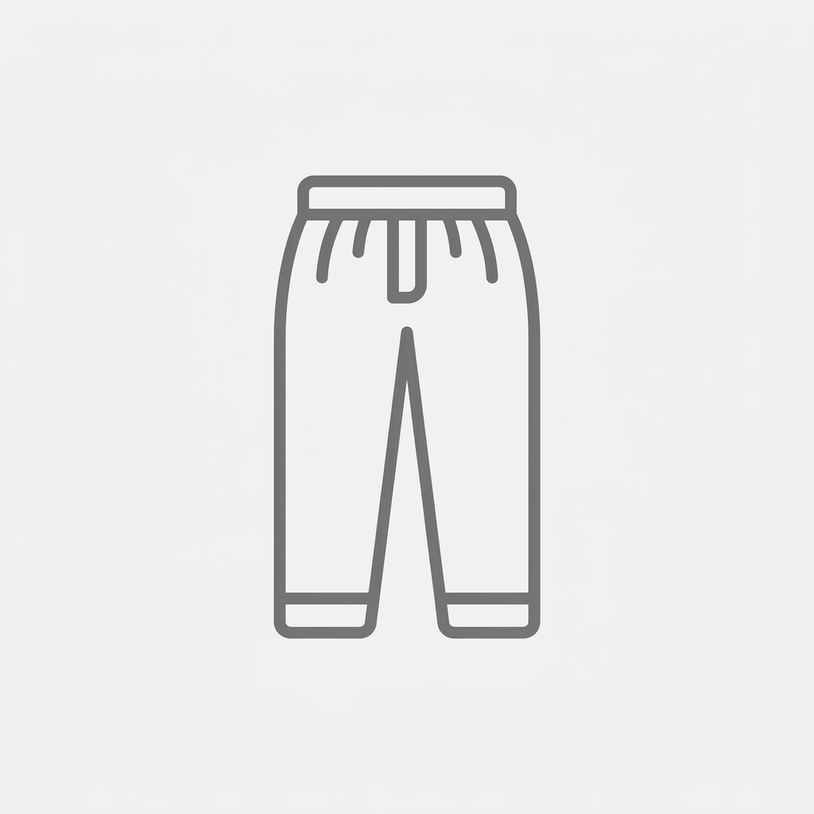
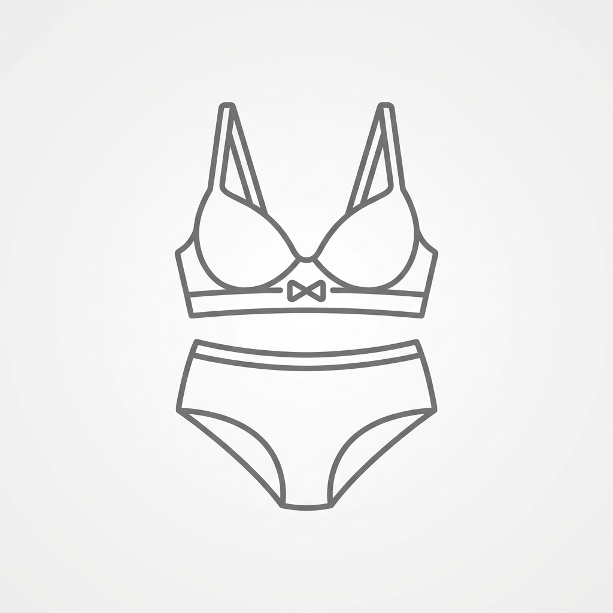
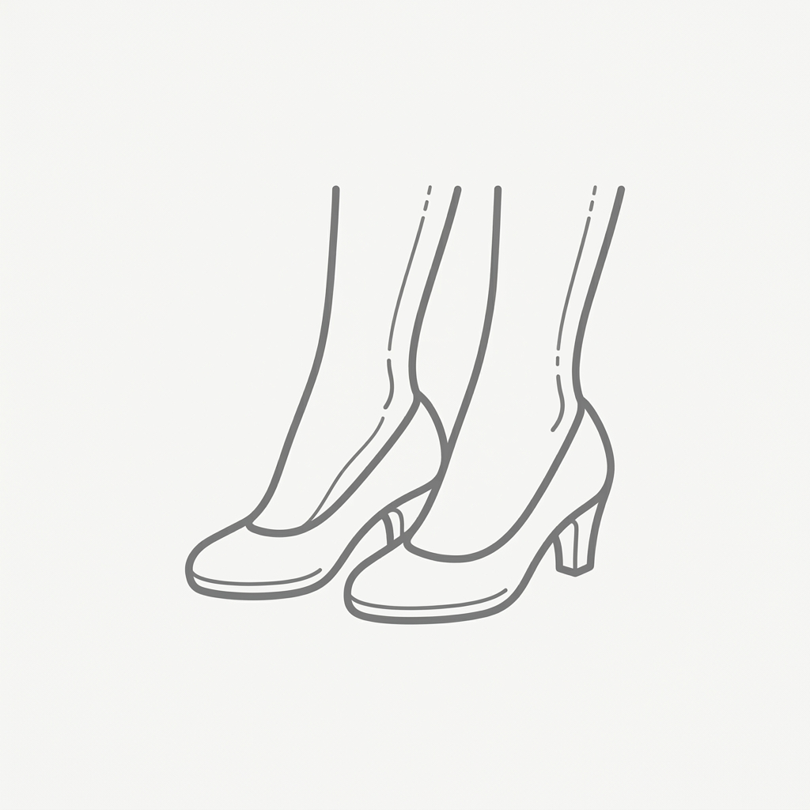

# 👗 【キャラクター名】衣装設定：【衣装名】

> [!abstract] コンセプト概要
> **「【一言コンセプト（例：隙のない完璧な会社員スタイル）】」**
> 属性：【季節（秋）】／【TPO（勤務・外出）】／【コントラスト（中）】

---

## 🖼️ 全体ビジュアル & カラーパレット

| 全体イメージ（※画像を入れてください） | 配色パレット | 画像生成タグ（AI Prompts） |
| :---: | :---: | :--- |
|  | `主色` #1E283A `副色` #622426 `挿色` #812E2A | `v-neck wrap dress, navy blue wool, midi length flare, black leather belt` |

---

## 🧩 パーツ別詳細仕様

| 部位 | 参照イメージ（※画像を入れてください） | アイテム名 | 詳細仕様（素材・配色・着こなしルール） |
| :--- | :---: | :--- | :--- |
| **👕 トップス** |  | **【アイテム名】** | **素材:** 【例：マットウール】 **配色:** 【例：紺碧】 **着方:** 【例：Vネック・第一ボタンまで留める】 |
| **👖 ボトムス** |  | **【アイテム名】** | **丈感:** 【例：ミディ丈フレア】 **ベルト:** 【例：黒レザー本革】 |
| **👙 インナー / 下着** |  | **【アイテム名】** | **タイプ:** 【例：繊細なレース上下セット】 **意味:** 【例：自律と防壁の象徴】 |
| **🧦 脚 / 靴** |  | **【アイテム名】** | **脚:** 【例：20〜30デニールストッキング】 **靴:** 【例：ポインテッドトゥ・パンプス】 **結び方:** 【例：パンプス（自分で脱着）】 |

---

## ⚡ 物語・破綻時の変化

> [!warning] 乱れ・破綻時の変化ルール
> * **トリガー:** 【例：キャンプ場の泥の中での屈服】
> * **視覚変化:** 【例：ストッキングの伝線・泥汚れ・パンプス脱げ】
> * **構造的意味:** 【例：完璧主義と教養の失墜】
